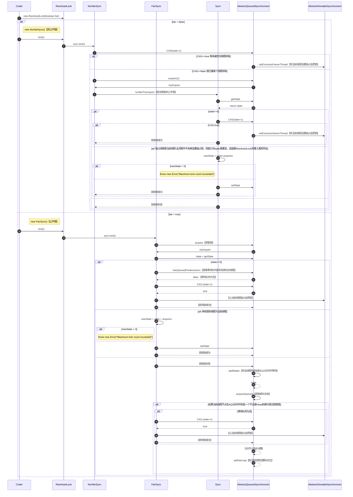
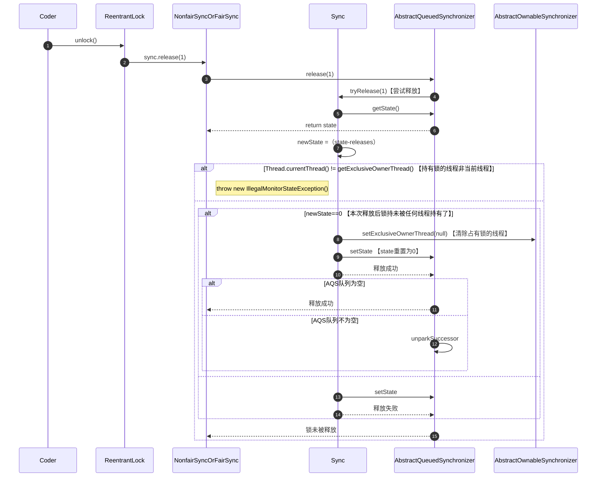

# 多线程与高并发

## 基础知识点

- 工作线程数不是设置的越大越好

- 工作线程数（线程池中线程数量）设多少合适?

  

  > **怎么得出W/C？**
  >
  > - 本地环境利用Jprofiler工具测算
  > - 远程环境用Arthas测算

## 线程创建方式

### **继承Thread**

```java
public static void main(String[] args) {
  new MyThread().start();
}

static class MyThread extends Thread {
  @Override
  public void run() {
    out.println("New Thread - extends Thread");
  }
}
```

### 实现Runnable接口

```java
public class ThreadCreate {
    public static void main(String[] args) {
        new Thread(new MyRunnable()).start();
    }

    static class MyRunnable implements Runnable {
        @Override
        public void run() {
            out.println("New Thread - implements Runnable");
        }
    }
}
```

### Lambda表达式

```java
public class ThreadCreate {
    public static void main(String[] args) {
        new Thread(() -> out.println("New Thread - Lambda"));
    }
}
```

### 线程池

```java
public class ThreadCreate {
    public static void main(String[] args) {
        //仅用于演示
        ExecutorService threadPool = Executors.newCachedThreadPool();
        threadPool.execute(() -> out.println("New Thread - threadPool"));
        threadPool.shutdown();
    }
}
```

### 实现Callable接口

```java
public class ThreadCreate {
    public static void main(String[] args) {
        //创建线程池
        ExecutorService threadPool = Executors.newCachedThreadPool();
      
        //基于线程池submit
        Future<String> future = threadPool.submit(new MyCallable());
        //阻塞等待返回值
        String data1 = future.get();
        out.println(data1);
        threadPool.shutdown();

        //基于实现RunnableFuture<V>
        FutureTask<String> task = new FutureTask<String>(new MyCallable());
        //创建线程并启动
        Thread thread = new Thread(task);
        thread.start();
        //阻塞等待返回值
        String data2 = future.get();
        out.println(data2);
    }

    static class MyCallable implements Callable {
        @Override
        public Object call() throws Exception {
            out.println("New Thread - implements Callable");
            return "success";
        }
    }
}
```

## 线程的六种状态

### NEW

> 线程刚刚创建，还没有启动

### RUNNABLE

> 可运行状态，由线程调度器可以安排执行 （包括`READY`和`RUNNING`两种细分状态）

### WAITING

> 等待被唤醒

### TIMED WAITING

> 隔一段时间后自动唤醒

### BLOCKED

> 被阻塞，正在等待锁

### TERMINATED

> 线程结束

### 代码验证

```java
public class ThreadState {
    public static void main(String[] args) throws Exception {
        //1: NEW
        //2: RUNNABLE
        //0 1 2
        //3: TERMINATED
        Thread thread1 = new Thread(() -> {
            out.println("2: " + Thread.currentThread().getState());
            for (int i = 0; i < 3; i++) {
                SleepHelper.sleepSeconds(1);
                out.print(i + " ");
            }
            //换行
            out.println();
        });

        out.println("1: " + thread1.getState());
        //thread1启动
        thread1.start();
        //等待thread1结束
        thread1.join();
        out.println("3: " + thread1.getState());

        //--------------------------------------------------------------------------------------------------
        //4: WAITING
        //thread2 Go On
        //5: TIMED_WAITING
        Thread thread2 = new Thread(() -> {
            //等待被唤醒
            LockSupport.park();
            out.println("thread2 Go On");
            SleepHelper.sleepSeconds(5);
        });

        thread2.start();
        SleepHelper.sleepSeconds(1);
        out.println("4: " + thread2.getState());

        LockSupport.unpark(thread2);
        SleepHelper.sleepSeconds(1);
        out.println("5: " + thread2.getState());

        //--------------------------------------------------------------------------------------------------
        //6: BLOCKED
        //thread3 Get Lock o
        Object o = new Object();
        Thread thread3 = new Thread(() -> {
            synchronized (o) {
                out.println("thread3 Get Lock:o");
            }
        });

        new Thread(() -> {
            synchronized (o) {
                SleepHelper.sleepSeconds(5);
            }
        }).start();
        //主线程睡一秒保证以上线程已经获得锁o
        SleepHelper.sleepSeconds(1);
        //启动thread3去竞争锁o
        thread3.start();
        SleepHelper.sleepSeconds(1);
        out.println("6: " + thread3.getState());

        //--------------------------------------------------------------------------------------------------
        //7: WAITING
        //thread4 Get Lock:o
        //JUC的锁由CAS来实现 -> '忙等待'：不会进入BLOCKED只会进入WAITING状态，只有synchronized这样的才会进入BLOCKED状态
        final Lock lock = new ReentrantLock();
        Thread thread4 = new Thread(() -> {
            lock.lock();
            out.println("thread4 Get Lock:o");
            lock.unlock();
        });

        new Thread(() -> {
            lock.lock();
            SleepHelper.sleepSeconds(5);
            lock.unlock();
        }).start();
        SleepHelper.sleepSeconds(1);

        thread4.start();
        SleepHelper.sleepSeconds(1);
        out.println("7: " + thread4.getState());

        //--------------------------------------------------------------------------------------------------
        //8: WAITING
        Thread thread5 = new Thread(LockSupport::park);
        thread5.start();
        SleepHelper.sleepSeconds(1);
        out.println("8: " + thread5.getState());
        LockSupport.unpark(thread5);
    }
}
```

### 总结


## Synchronized锁

### 锁方法

> 带`Synchronized`的方法可以与不带`Synchronized`的方法可在不同线程中同时运行

```java
public class SynchronizedTest {
    synchronized void method1() {
        out.println(Thread.currentThread().getName() + " method1 start...");
        try {
            Thread.sleep(10000);
        } catch (InterruptedException e) {
            e.printStackTrace();
        }
        out.println(Thread.currentThread().getName() + " method1 end...");
    }

    void method2() {
        out.println(Thread.currentThread().getName() + " method2 start...");
        try {
            Thread.sleep(5000);
        } catch (InterruptedException e) {
            e.printStackTrace();
        }
        out.println(Thread.currentThread().getName() + " method2 end...");
    }

    public static void main(String[] args) {
        SynchronizedTest test = new SynchronizedTest();
        new Thread(test::method1, "thread1").start();
        new Thread(test::method2, "thread2").start();
    }
}
```

### 锁的可重入属性

```java
public class SynchronizedReentrant {
    synchronized void method1() {
        out.println(Thread.currentThread().getName() + " method1 start...");
      SleepHelper.sleepSeconds(1);
        method2();
        out.println(Thread.currentThread().getName() + " method1 end...");
    }

    synchronized void method2() {
        out.println(Thread.currentThread().getName() + " method2 start...");
        SleepHelper.sleepSeconds(2);
        out.println(Thread.currentThread().getName() + " method2 end...");
    }

    public static void main(String[] args) {
        new Thread(new SynchronizedReentrant()::method1, "thread1").start();
    }
}
```

### 锁与异常

```java
public class SynchronizedAndException {
    int count = 0;

    public static void main(String[] args) {
        SynchronizedAndException test = new SynchronizedAndException();
        new Thread(test::method1, "thread1").start();
        new Thread(test::method1, "thread2").start();
    }

    synchronized void method1() {
        out.println(Thread.currentThread().getName() + " method1 start...");
        while (true) {
            count++;
            out.println(Thread.currentThread().getName() + " count = " + count);
            SleepHelper.sleepSeconds(1);
            if (count == 5) {
                //抛出ArithmeticException异常，锁被释放
                //如果catch异常则锁不被释放，循环继续
                int i = 1 / 0;
                out.println(i);
            }
        }
    }
}
```

> 运行结果

```shell
thread1 method1 start...
thread1 count = 1
thread1 count = 2
thread1 count = 3
thread1 count = 4
thread1 count = 5
thread2 method1 start...
thread2 count = 6
Exception in thread "thread1" java.lang.ArithmeticException: / by zero
	at thread_synchronized.SynchronizedAndException.method1(SynchronizedAndException.java:28)
	at java.lang.Thread.run(Thread.java:750)
thread2 count = 7
thread2 count = 8
thread2 count = 9
thread2 count = 10
```

### Synchronized底层实现

#### 锁升级

> 早期JDK`Synchronized`是重量级的，每次都要找操作系统内核申请这把锁，JDK1.5后进行了改进
>
> **如果要锁定某一个对象，则会在这个对象头的某两位来指定到底锁的是什么类型的锁，在对象头上还记录着是哪个线程申请的这把锁**
>
> - synchronized(Object)
> - markword记录这个线程ID（偏向锁）
> - 偏向锁如果存在线程争用则升级为自旋锁
> - 自旋锁自旋10次后升级为重量级锁，去操作系统内核申请这把锁

##### 偏向锁

> 第一次进来先不锁定这把锁，只记录一个线程ID，下一次再进来如果还是原来那个线程就可以直接访问，如果下一次进来的线程不是原来记录的线程就会进行锁升级

##### 自旋锁

> 如果一个线程已经拿到这把锁了，当另一个线程来的时候就会while循环判断是否能获得这把锁，循环10次后如果还是不能获得锁，则再次进行锁升级

##### 重量级锁

> 经过操作系统进入等待队列，进入等待队列后则不再占用CPU资源

#### 锁的选用

> - 执行时间长，线程数较多的用系统锁（重量级锁）
>
> - 执行时间短，线程数较少的用自旋锁

### 注意事项

> - synchronized(Object) 锁的对象不能是`String常量`、`Integer`、`Long`
>
> - synchronized锁的是对象而不是代码
> - `synchronized method()`时锁的是this
> - `static synchronized method()`时锁的是Xx.class

## Volatile

#### 保证线程可见性

#### 禁止指令重排序

##### **DCL单例** **Double Check**

```java
public class Singleton06 {
    private static volatile Singleton06 INSTANCE;

    private Singleton06() {
    }

    public static Singleton06 getInstance() {
        if (INSTANCE == null) {
            synchronized (Singleton06.class) {
                // 双重检查
                if (INSTANCE == null) {
                    try {
                        Thread.sleep(1);
                    } catch (InterruptedException e) {
                        e.printStackTrace();
                    }
                    INSTANCE = new Singleton06();
                }
            }
        }
        return INSTANCE;
    }

    public static void main(String[] args) {
        for (int i = 0; i < 100; i++) {
            new Thread(() -> {
                System.out.println(Singleton06.getInstance().hashCode());
            }).start();
        }
    }
}
```

## 线程`interrupt`

> 现成“打断” - 并非真正被打断而是`设置标志位`

### 三种方法

#### interrupt()

> 打断某个线程（设置标志位）

#### isInterrupted()

> 查询某个线程是否被打断过（查询标志位）

#### static interrupted()

> 查询当前线程是否被打断过，并重置打断标志

```java
public void interrupt()            //t.interrupt() 打断t线程（设置t线程某给标志位f=true，并不是打断线程的运行）
public boolean isInterrupted()     //t.isInterrupted() 查询打断标志位是否被设置（是不是曾经被打断过）
public static boolean interrupted()//Thread.interrupted() 查看“当前”线程是否被打断，如果被打断，恢复标志位
```

### 代码演示

#### interrupt和`isInterrupted`

```java
public class ThreadInterruptAndIsInterrupted {
    public static void main(String[] args) {
        Thread thread = new Thread(() -> {
            for (; ; ) {
                if (Thread.currentThread().isInterrupted()) {
                    System.out.println("Thread is interrupted...");
                    System.out.println(Thread.currentThread().isInterrupted());
                    break;
                }
            }
        });
        thread.start();
        SleepHelper.sleepSeconds(2);
        thread.interrupt();
    }
}
```

#### interrupt 和 `Interrupted`

```java
public class ThreadInterruptAndInterrupted {
    public static void main(String[] args) {

        Thread thread = new Thread(() -> {
            for (; ; ) {
                if (Thread.interrupted()) {
                    System.out.println("Thread is interrupted...");
                    System.out.println(Thread.interrupted());
                }
            }
        });
        thread.start();
        SleepHelper.sleepSeconds(2);
        thread.interrupt();

        //static interrupt ： 当前线程查询并重置标志位,由于是静态方法，可以直接调用（谁调就查谁）这边自然是查主线程
        System.out.println("main: " + thread.interrupted());
    }
}
```

#### interrupt和Sleep

```java
public class ThreadInterruptAndSleep {
    public static void main(String[] args) {
        Thread thread = new Thread(() -> {
            try {
                Thread.sleep(10000);
            } catch (InterruptedException e) {
                out.println("Thread is interrupted...");
                out.println(Thread.currentThread().isInterrupted());
            }
        });
        thread.start();
        SleepHelper.sleepSeconds(5);
        thread.interrupt();
    }
}
```

#### interrupt和Wait

```java
public class ThreadInterruptAndWait {
    public static Object o = new Object();

    public static void main(String[] args) {
        Thread thread = new Thread(() -> {
            synchronized (o) {
                try {
                    o.wait();
                } catch (InterruptedException e) {
                    out.println("Thread is interrupted...");
                    out.println(Thread.currentThread().isInterrupted());
                }
            }
        });
        thread.start();
        SleepHelper.sleepSeconds(5);
        thread.interrupt();
    }
}
```

#### interrupt不能打断Synchronized锁竞争过程

```java
public class ThreadInterruptAndSynchronized {
    public static Object o = new Object();

    public static void main(String[] args) {
        Thread thread1 = new Thread(() -> {
            synchronized (o){
                SleepHelper.sleepSeconds(10);
            }
        });
        thread1.start();
        SleepHelper.sleepSeconds(1);

        Thread thread2 = new Thread(() -> {
            synchronized (o){}
            System.out.println("thread2 end...");
        });

        thread2.start();
        SleepHelper.sleepSeconds(1);

        //不会对正在竞争锁的线程产生影响，也正说明interrupt并非真正打断线程，只是设置标志位
        thread2.interrupt();
    }
}
```

#### interrupt不能打断JUC ReentrantLock锁竞争过程

```java
public class ThreadInterruptAndReentrantLock {
    public static ReentrantLock lock = new ReentrantLock();

    public static void main(String[] args) {
        Thread thread1 = new Thread(() -> {
            lock.lock();
            try {
                Thread.sleep(10000);
            } catch (InterruptedException e) {
                e.printStackTrace();
            } finally {
                lock.unlock();
            }
            out.println("thread1 end...");
        });
        thread1.start();
        SleepHelper.sleepSeconds(1);

        Thread thread2 = new Thread(() -> {
            lock.lock();
            try {
            } finally {
                lock.unlock();
            }
            out.println("thread2 end...");
        });

        thread2.start();
        SleepHelper.sleepSeconds(1);

        //不会对正在竞争锁的线程产生影响，也正说明interrupt并非真正打断线程，只是设置标志位
        thread2.interrupt();
    }
}
```

#### 打断JUC ReentrantLock锁竞争过程

```java
public class ThreadInterruptAndReentrantLockInterruptibly {
    public static ReentrantLock lock = new ReentrantLock();

    public static void main(String[] args) {
        Thread thread1 = new Thread(() -> {
            lock.lock();
            try {
                Thread.sleep(10000);
            } catch (InterruptedException e) {
                e.printStackTrace();
            } finally {
                lock.unlock();
            }
            out.println("thread1 end...");
        });
        thread1.start();
        SleepHelper.sleepSeconds(1);

        
        Thread thread2 = new Thread(() -> {
            out.println("thread2 start...");
            try {
                //lockInterruptibly: 可以被打断的过程
                lock.lockInterruptibly();
            } catch (InterruptedException e) {
                e.printStackTrace();
            } finally {
                lock.unlock();
            }
            out.println("thread2 end...");
        });

        thread2.start();
        SleepHelper.sleepSeconds(1);

        //不会对正在竞争锁的线程产生影响，也正说明interrupt并非真正打断线程，只是设置标志位
        thread2.interrupt();
    }
}
```

> 被打断后catch住InterruptedException

```shell
thread2 start...
java.lang.InterruptedException
	at java.util.concurrent.locks.AbstractQueuedSynchronizer.doAcquireInterruptibly(AbstractQueuedSynchronizer.java:898)
	at java.util.concurrent.locks.AbstractQueuedSynchronizer.acquireInterruptibly(AbstractQueuedSynchronizer.java:1222)
	at java.util.concurrent.locks.ReentrantLock.lockInterruptibly(ReentrantLock.java:335)
	at thread_basic.ThreadInterruptAndReentrantLockInterruptibly.lambda$main$1(ThreadInterruptAndReentrantLockInterruptibly.java:36)
	at java.lang.Thread.run(Thread.java:750)
Exception in thread "Thread-1" java.lang.IllegalMonitorStateException
	at java.util.concurrent.locks.ReentrantLock$Sync.tryRelease(ReentrantLock.java:151)
	at java.util.concurrent.locks.AbstractQueuedSynchronizer.release(AbstractQueuedSynchronizer.java:1261)
	at java.util.concurrent.locks.ReentrantLock.unlock(ReentrantLock.java:457)
	at thread_basic.ThreadInterruptAndReentrantLockInterruptibly.lambda$main$1(ThreadInterruptAndReentrantLockInterruptibly.java:40)
	at java.lang.Thread.run(Thread.java:750)
```

## 线程`结束`

### 被废弃的方法

#### thread.stop

```java
public class ThreadStop {
    public static void main(String[] args) {
        Thread thread = new Thread(() -> {
            while (true) {
                out.println("Go On...");
                SleepHelper.sleepSeconds(1);
            }
        });

        thread.start();
        SleepHelper.sleepSeconds(5);

        //被废弃的方法，不建议使用
        //不管线程当前处于什么状态，直接干掉，非常容易产生数据不一致问题
        thread.stop();
    }
}
```

#### thread.suspend 和 thread.resume

```java
public class ThreadSuspendAndResume {
    public static void main(String[] args) {
        Thread thread = new Thread(() -> {
            while (true) {
                out.println("Go On...");
                SleepHelper.sleepSeconds(1);
            }
        });

        thread.start();
        SleepHelper.sleepSeconds(5);
        //5秒后暂停
        //如果暂停的时候持有一把没被释放的锁，如果忘记重新继续那这把锁永远不会被释放继而产生死锁问题
        thread.suspend();
        SleepHelper.sleepSeconds(3);
        //暂停3秒后继续
        thread.resume();
    }
}
```

### 优雅地结束一个线程

#### 利用Volatile修饰一个标志位

```java
public class ThreadEndVolatile {
    public static volatile boolean running = true;

    public static void main(String[] args) {

        Thread thread = new Thread(() -> {
            long i = 0L;
            while (running) {
                i++;
            }

            //end -- i = 3957503196
            //end -- i = 3512231997
            //不能控制具体多长时间能够停止
            System.out.println("end -- i = " + i);
        });

        thread.start();
        SleepHelper.sleepSeconds(1);

        running = false;
    }
}
```

#### 利用interrupt设置标志位（更优雅）

> Volatile中有sleep、wait的处理是没办法立刻结束的

```java
public class ThreadEndInterruptAndNormalThread {
    public static void main(String[] args) {

        Thread thread = new Thread(() -> {
            while (!Thread.interrupted()) {
                //sleep、wait的处理也可以正确结束
            }
            System.out.println("thread end");
        });

        thread.start();
        SleepHelper.sleepSeconds(1);

        thread.interrupt();
    }
}
```

## 并发编程三大特性

### 可见性（Visibility）

#### 可见性问题演示

> 此时运行程序后无论如何都不会打印`test end...`
>
> - `running`位于主内存中，但是`running`被主线程和`thread1`这两个线程所用到，线程启动会把`running`从主内存拷贝出来存到两个线程的本地缓存
> - `thread1`会去读`running`,但是每次循环读的是线程本地缓存中的内容，并不是读的主内存的`running`
> - 主线程会把本地缓存中的`running`修改为`false`,影响不到主内存中的`running`
> - 这种一个线程改了但另一个线程看不见新的值就是线程的`可见性`问题


```java
public class ThreadVolatileV1 {
    private static boolean running = true;
 
    public static void main(String[] args) {
        new Thread(ThreadVolatile::test, "thread1").start();
        SleepHelper.sleepSeconds(1);
        running = false;
    }

    private static void test() {
        System.out.println("test start...");
        while (running) {

        }
        System.out.println("test end...");
    }
}
```

> 运行结果

```shell
test start...

#迟迟等不到end
```

#### Volatile保证可见性

> - 用`Volatile`修饰的这块内存，每次循环都回去主内存重新加载一遍`running`供线程读取
> - 只要主线程本地缓存中`running`被修改立马重新刷新到主内存中


```java
public class ThreadVolatile {
    private static volatile boolean running = true;

    public static void main(String[] args) {
        new Thread(ThreadVolatile::test, "thread1").start();
        SleepHelper.sleepSeconds(1);
        running = false;
    }

    private static void test() {
        System.out.println("test start...");
        while (running) {

        }
        System.out.println("test end...");
    }
}
```

> 运行结果

```shell
test start...
test end...
```

#### println导致线程可见性

> 一些语句也可能触发内存缓存同步刷新

```java
public class ThreadVolatile {
    private static  boolean running = true;

    public static void main(String[] args) {
        new Thread(ThreadVolatile::test, "thread1").start();
        SleepHelper.sleepSeconds(1);
        running = false;
    }

    private static void test() {
        System.out.println("test start...");
        while (running) {
            //println 底层是`synchronized`，也可保证线程可见性
            System.out.println("Hello Volatile");
        }
        System.out.println("test end...");
    }
}
```

#### Volatile修饰引用类型的问题

> `只能保证引用本身`的可见性，`不能保证内部字段`的可见性

```java
public class ThreadVolatileReference {
    private volatile static TestClass t = new TestClass();

    public static void main(String[] args) {
        new Thread(t::test Method, "thread1").start();
        SleepHelper.sleepSeconds(1);
        t.running = false;
    }

    private static class TestClass {
        boolean running = true;

        void testMethod() {
            out.println("test start...");
            while (running) {
            }
            out.println("test end...");
        }
    }
}
```

#### 三级缓存(补充)

- 从CPU的ALU到`Registers`、`L1`、`L2`、`L3`、`Main Memory`

  

##### 多核CPU

> - 当`Registers`需要一个数据时，先到`L1`取，`L1`没有的话到`L2`取，以此类推直到取到`主内存`
> - 当主内存中有相关数据时，会先在`L3`存一份,然后再到`L2`存一份、再往`L1`存一份、最后丢到`寄存器`


### 有序性（Ordering）

#### 乱序

> 为了提高效率
>
> - 要求前后两条指令不存在依赖关系


##### 乱序原则

- `as-if-serial`（看上去像序列化的）
- 不影响单线程的最终一致 性

### 原子性（Atomicity）

##  CAS

> `Compare And Swap` or`Compare And Set`
>
> **无锁自旋**
>
> JUC下所有`Atomic`类都是采用`CAS`方式保证线程安全的
>
> **没有锁的状态下，可以保持多个线程对一个值递增**


### ABA问题

- 加版本号
- 加boolean类型

### AtomicInteger

#### 使用方法

```java
public class ThreadAtomicInteger {
    AtomicInteger count = new AtomicInteger(0);

    void method() {
        for (int i = 0; i < 10000; i++) {
            count.incrementAndGet();
        }
    }

    public static void main(String[] args) {
        ThreadAtomicInteger threadAtomicInteger = new ThreadAtomicInteger();
        ArrayList<Thread> threads = new ArrayList<>();
        for (int i = 0; i < 10; i++) {
            threads.add(new Thread(threadAtomicInteger::method, "thread" + i));
        }

        threads.forEach((o) -> o.start());
        threads.forEach((o) -> {
            try {
                o.join();
            } catch (InterruptedException e) {
                e.printStackTrace();
            }
        });

        System.out.println(threadAtomicInteger.count);
    }
}
```

#### 底层原理

> 调用`Unsafe`类中`getAndAddInt`方法


> `JDK1.8`中`getAndAddInt`方法中调用了`compareAndSwapInt`方法

​	

> `JDK11`后调用了`weakCompareAndSetInt`方法,可能引入了弱指针，对于垃圾回收效率有提升

​	

#### Unsafe

> 可以直接实现C/C++中编码的能力，例如：
>
> 内存分配：
>
> 内存释放：

> 不同版本JDK中getUnsafe区别
>
> - Unsafe是单例的
>
> - 1.8中需要通过反射并判定类加载器是否是SystemDomainLoader才能拿到，否则没有权限使用
> - 11后可以直接返回

####  LongAdder

> `AtomicLong`VS`synchronized`VS`LongAdder`

```java
public class ThreadAtomicVsSyncVsLongAdder {
    static AtomicLong count1 = new AtomicLong(0L);
    static long count2 = 0L;
    static LongAdder count3 = new LongAdder();

    public static void main(String[] args) throws InterruptedException {
        Thread[] threads = new Thread[1000];
        for (int i = 0; i < threads.length; i++) {
            threads[i] = new Thread(() -> {
                for (int j = 0; j < 100000; j++) {
                    count1.incrementAndGet();
                }
            });
        }
        long start = System.currentTimeMillis();

        for (Thread thread : threads) {
            thread.start();
        }

        for (Thread thread : threads) {
            thread.join();
        }

        long end = System.currentTimeMillis();
        System.out.println("Atomic: " + count1.get() + " time " + (end - start));

        //-------------------------------------------------------------------------------

        Object o = new Object();
        for (int i = 0; i < threads.length; i++) {
            threads[i] = new Thread(() -> {
                for (int j = 0; j < 100000; j++) {
                    synchronized (o) {
                        count2++;
                    }
                }
            });
        }

        start = System.currentTimeMillis();

        for (Thread thread : threads) {
            thread.start();
        }

        for (Thread thread : threads) {
            thread.join();
        }

        end = System.currentTimeMillis();
        System.out.println("synchronized: " + count2 + " time " + (end - start));

        //-------------------------------------------------------------------------------

        for (int i = 0; i < threads.length; i++) {
            threads[i] = new Thread(() -> {
                for (int j = 0; j < 100000; j++) {
                    count3.increment();
                }
            });
        }

        start = System.currentTimeMillis();

        for (Thread thread : threads) {
            thread.start();
        }

        for (Thread thread : threads) {
            thread.join();
        }

        end = System.currentTimeMillis();
        System.out.println("LongAdder: " + count3 + " time " + (end - start));
    }
}
```

>  运行结果：LongAdder效率最高

```shell
Atomic: 100000000 time 1531
synchronized: 100000000 time 1522
LongAdder: 100000000 time 193
```

##### 原理

> 底层分段锁,将线程均分为几段去执行，最后计算所有段的总和

## JUC同步锁

### ReentranLock VS synchronized

> 可重入锁-用于替代`synchronized`

#### synchronized 锁的重入概念

> 当`method1`和`method2`都上了锁时，如果两个方法在同一个线程内调用是具备可重入能力的，如果在不同线程中分别调用这两个方法则会产生锁竞争
>
> `synchronized`必须可重入，否则如果当前类继承自某父类，并且父类中某方法是`synchronized`修饰的方法，那子类则无法重写父类方法。
>
> - `synchronized`当作用域内代码执行完自动解锁

```java
public class ThreadReentrantLockBySync {
    synchronized void method1() {
        for (int i = 0; i < 10; i++) {
            try {
                TimeUnit.SECONDS.sleep(1);
            } catch (InterruptedException e) {
                e.printStackTrace();
            }
            out.println(i);
            if (i == 3) {
                //由于这两个synchronized处于同一个线程内，所以是可重入的，会调用method2
                method2();
            }
        }
    }

    synchronized void method2() {
        out.println("method2...");
        try {
            TimeUnit.SECONDS.sleep(1);
        } catch (InterruptedException e) {
            e.printStackTrace();
        }
    }

    public static void main(String[] args) throws InterruptedException {
        ThreadReentrantLock reentrantLock = new ThreadReentrantLock();
        new Thread(reentrantLock::method1).start();
        TimeUnit.SECONDS.sleep(1);
        // 由于不是同一个线程导致method1在执行的时候method2不会获得这把锁，也就是不可重入，所以在method1结束前不会调用method2
        // new Thread(reentrantLock::method2).start();
    }
}
```

#### ReentranLock

```java
public class ThreadReentrantLock {
    Lock lock = new ReentrantLock();

    void method1() {
        try {
            lock.lock();
            for (int i = 0; i < 10; i++) {
                TimeUnit.SECONDS.sleep(1);
                out.println(i);
            }
        } catch (InterruptedException e) {
            e.printStackTrace();
        } finally {
            lock.unlock();
        }
    }

   void method2() {
        try {
            lock.lock();
            out.println("method2...");
        } finally {
            lock.unlock();
        }
    }

    public static void main(String[] args) throws InterruptedException {
        ThreadReentrantLock reentrantLock = new ThreadReentrantLock();
        new Thread(reentrantLock::method1).start();
        TimeUnit.SECONDS.sleep(1);
        //与synchronized相同，在不同线程中会等method1锁释放后method2才会获得这把锁
        new Thread(reentrantLock::method2).start();
    }
}
```

#####  TryLock

```java
public class ThreadReentrantLockAndTryLock {
    Lock lock = new ReentrantLock();

    void method1() {
        try {
            lock.lock();
            for (int i = 0; i < 3; i++) {
                TimeUnit.SECONDS.sleep(1);
                out.println(i);
            }
        } catch (InterruptedException e) {
            e.printStackTrace();
        } finally {
            lock.unlock();
        }
    }

    void method2() {
        boolean locked = false;
        try {
            //尝试5秒内获得锁，method1中3秒后释放锁，因此method2可以在5秒内获得获得这把锁
            locked = lock.tryLock(5, TimeUnit.SECONDS);
            out.println("method2..." + locked);
        } catch (InterruptedException e) {
            e.printStackTrace();
        } finally {
            if (locked) {
                lock.unlock();
            }
        }
    }

    public static void main(String[] args) throws InterruptedException {
        ThreadReentrantLockAndTryLock reentrantLock = new ThreadReentrantLockAndTryLock();
        new Thread(reentrantLock::method1).start();
        TimeUnit.SECONDS.sleep(1);
        //与synchronized相同，在不同线程中会等method1锁释放后method2才会获得这把锁
        new Thread(reentrantLock::method2).start();
    }
}
```

##### LockInterruptibly

```java
public class ThreadReentrantLockAndLockInterruptibly {

    public static void main(String[] args) {
        Lock lock = new ReentrantLock();
        Thread thread1 = new Thread(() -> {
            try {
                lock.lock();
                out.println("thread1 start");
                TimeUnit.SECONDS.sleep(Integer.MAX_VALUE);
                out.println("thread1 end");
            } catch (InterruptedException e) {
                out.println("thread1 Interrupted!!!");
            } finally {
                lock.unlock();
            }
        });
        thread1.start();

        Thread thread2 = new Thread(() -> {
            try {
                TimeUnit.SECONDS.sleep(1);
                lock.lockInterruptibly();
                out.println("thread2 start");
                TimeUnit.SECONDS.sleep(5);
                out.println("thread2 end");
            } catch (InterruptedException e) {
                out.println("thread2 Interrupted!!!");
            } finally {
                lock.unlock();
            }
        });
        thread2.start();

        try {
            TimeUnit.SECONDS.sleep(1);
        } catch (InterruptedException e) {
            e.printStackTrace();
        }

        thread2.interrupt();
    }
}
```

##### Fair lock（公平锁）

> 有一个等待队列，后进队列的线程先检查一下等待队列有没有未执行的线程

```java
public class ThreadReentrantLockAndFairLock extends Thread {
    //fair：true为公平锁
    public static ReentrantLock lock = new ReentrantLock(true);

    public static void main(String[] args) {
        ThreadReentrantLockAndFairLock fairLock = new ThreadReentrantLockAndFairLock();
        Thread thread1 = new Thread(fairLock);
        Thread thread2 = new Thread(fairLock);
        thread1.start();
        thread2.start();
    }

    @Override
    public void run() {
        for (int i = 0; i < 100; i++) {
            lock.lock();
            try {
                out.println(Thread.currentThread().getName() + " GET LOCK");
            } finally {
                lock.unlock();
            }
        }
    }
}
```

> 执行结果

```ABAP
Thread-1 GET LOCK
Thread-2 GET LOCK
Thread-1 GET LOCK
Thread-2 GET LOCK
Thread-1 GET LOCK
Thread-2 GET LOCK
Thread-1 GET LOCK
Thread-2 GET LOCK
Thread-1 GET LOCK
Thread-2 GET LOCK
Thread-1 GET LOCK
Thread-2 GET LOCK
Thread-1 GET LOCK
...
...
...
```

### CountDownLatch VS Join

> 倒计时门闩
>
> - CountDownLatch比join灵活一点
>
> - join必须等待一个线程结束才会 计数
> - CountDownLatch可以在一个线程内一直countDown

#### 代码演示

```java
public class ThreadCountDownLatch {
    public static void main(String[] args) {
        usingCountDownLatch();
        usingJoin();
    }


    private static void usingCountDownLatch() {
        Thread[] threads = new Thread[100];
        CountDownLatch latch = new CountDownLatch(threads.length);
        for (int i = 0; i < threads.length; i++) {
            threads[i] = new Thread(() -> {
                int result = 0;
                for (int j = 0; j < 10000; j++) {
                    result += j;
                }
                latch.countDown();
            });
        }

        for (int i = 0; i < threads.length; i++) {
            threads[i].start();
        }

        try {
            latch.await();
        } catch (InterruptedException e) {
            e.printStackTrace();
        }

        System.out.println("End Latch");
    }

    private static void usingJoin() {
        Thread[] threads = new Thread[100];
        for (int i = 0; i < threads.length; i++) {
            threads[i] = new Thread(() -> {
                int result = 0;
                for (int j = 0; j < 10000; j++) {
                    result += j;
                }
            });
        }

        for (int i = 0; i < threads.length; i++) {
            threads[i].start();
        }

        for (int i = 0; i < threads.length; i++) {
            try {
                threads[i].join();
            } catch (InterruptedException e) {
                e.printStackTrace();
            }
        }

        System.out.println("End Join");
    }
}
```

### CyclicBarrier

> 循环障碍

#### 代码演示

```java
public class ThreadCyclicBarrier {
    public static void main(String[] args) {
        CyclicBarrier barrier = new CyclicBarrier(4, () -> System.out.println("有一个满编队跳创乐园了"));

        for (int i = 0; i < 100; i++) {
            new Thread(() -> {
                try {
                    barrier.await();
                } catch (InterruptedException e) {
                    e.printStackTrace();
                } catch (BrokenBarrierException e) {
                    e.printStackTrace();
                }
            }).start();
        }
    }
}
```

### 使用场景

> 复杂操作：数据库、网络、文件
>
> 并发执行：不同线程执行不同操作，等所有操作线程都执行完了（执行完成目标个线程数后）才能执行内部逻辑

### 补充

> Guava RateLimiter  - 限流

### Phaser

#### 代码演示

> new Person
>
> 代表婚礼出席人

```java
public class Person implements Runnable {
    static Random random = new Random();

    private String name;
    private MarriagePhaser phaser;

    public Person(String name, MarriagePhaser phaser) {
        this.name = name;
        this.phaser = phaser;
    }

    @Override
    public void run() {
        arrive();
        eat();
        leave();
        hug();
    }

    //到场
    public void arrive() {
        SleepHelper.sleepSeconds(random.nextInt(10));
        System.out.println(name + "到达现场~");
        phaser.arriveAndAwaitAdvance();
    }
		//吃饭
    public void eat() {
        SleepHelper.sleepSeconds(random.nextInt(10));
        System.out.println(name + "吃完~");
        phaser.arriveAndAwaitAdvance();
    }
		//离开
    public void leave() {
        SleepHelper.sleepSeconds(random.nextInt(10));
        System.out.println(name + "离开~");
        phaser.arriveAndAwaitAdvance();
    }
		//洞房
    public void hug() {
        if ("新郎".equals(name) || "新娘".equals(name)) {
            SleepHelper.sleepSeconds(random.nextInt(10));
            System.out.println(name + "入洞房~");
            phaser.arriveAndAwaitAdvance();
        } else {
          	//本阶段出新郎新娘可参与，其他人不得入内
            phaser.arriveAndDeregister();
        }
    }
}
```

> new MarriagePhaser
>
> 代表婚礼进行阶段
>
> 进行婚礼阶段参与人数统计

```java
public class MarriagePhaser extends Phaser {
    @Override
    protected boolean onAdvance(int phase, int registeredParties) {
        switch (phase) {
            case 0:
                System.out.println("所有人到齐了~" + registeredParties);
                System.out.println();
                return false;
            case 1:
                System.out.println("所有人吃完了~" + registeredParties);
                System.out.println();
                return false;
            case 2:
                System.out.println("所有人离开了了~" + registeredParties);
                System.out.println();
                return false;
            case 3:
                System.out.println("婚礼结束~" + registeredParties);
                System.out.println();
                return true;
        }
        return false;
    }
}
```

> new ThreadPhaser

```java
public class ThreadPhaser {
    static MarriagePhaser phaser = new MarriagePhaser();

    public static void main(String[] args) {
        phaser.bulkRegister(7);
        for (int i = 0; i < 5; i++) {
            new Thread(new Person("p" + i, phaser)).start();
        }
        new Thread(new Person("新郎",phaser)).start();
        new Thread(new Person("新娘",phaser)).start();
    }
}
```

> 执行结果

```ABAP
===阶段一===
p1到达现场~
新娘到达现场~
p0到达现场~
p4到达现场~
新郎到达现场~
p2到达现场~
p3到达现场~
所有人到齐了~7

===阶段二===
p4吃完~
p3吃完~
p0吃完~
新郎吃完~
p1吃完~
p2吃完~
新娘吃完~
所有人吃完了~7

===阶段三===
p4离开~
p2离开~
新娘离开~
p3离开~
新郎离开~
p1离开~
p0离开~
所有人离开了了~7

===阶段四===
新娘入洞房~
新郎入洞房~
婚礼结束~2
```

### ReadWriteLock

#### 代码演示

```java
public class ThreadReadWriteLock {
    private static int VALUE;
  

    static Lock lock = new ReentrantLock();

    static ReadWriteLock readWriteLock = new ReentrantReadWriteLock();
    static Lock readLock = readWriteLock.readLock();
    static Lock writeLock = readWriteLock.writeLock();

    public static void main(String[] args) {
        //用ReentrantLock对于类似多线程操作会非常慢
        // Runnable readRunnable = () -> read(lock);
        // Runnable writeRunnable = () -> write(lock, new Random().nextInt());

        Runnable readRunnable = () -> read(readLock);
        Runnable writeRunnable = () -> write(writeLock, new Random().nextInt());

        for (int i = 0; i < 18; i++) {
            new Thread(readRunnable).start();
        }
        for (int i = 0; i < 2; i++) {
            new Thread(writeRunnable).start();
        }
    }

    public static void read(Lock lock) {
        try {
            lock.lock();
            Thread.sleep(1000);
            out.println("read over...");
        } catch (InterruptedException e) {
            e.printStackTrace();
        } finally {
            lock.unlock();
        }
    }

    public static void write(Lock lock, int value) {
        try {
            lock.lock();
            Thread.sleep(1000);
            VALUE = value;
            out.println("write over...");
        } catch (InterruptedException e) {
            e.printStackTrace();
        } finally {
            lock.unlock();
        }
    }
}
```

### Semaphore

> 信号灯

#### 代码演示

```java
public class ThreadSemaphore {
    public static void main(String[] args) {
      	//fair:true 公平锁 类似于排队插队
        Semaphore semaphore = new Semaphore(2,true);
        new Thread(() -> {
            try {
                //将permits改为0，其他线程acquire不到
                semaphore.acquire();
                System.out.println("T1 RUNNING...");
                Thread.sleep(200);
                System.out.println("T1 RUNNING...");
            } catch (InterruptedException e) {
                e.printStackTrace();
            } finally {
                //将permits改为1
                semaphore.release();
            }
        }).start();

        new Thread(() -> {
            try {
                semaphore.acquire();
                System.out.println("T2 RUNNING...");
                Thread.sleep(200);
                System.out.println("T2 RUNNING...");
            } catch (InterruptedException e) {
                e.printStackTrace();
            }finally {
                //将permits改为1
                semaphore.release();
            }
        }).start();
    }
}
```

### Exchanger

> 数据交换器


#### 代码演示

```java
public class ThreadExchanger {
    static Exchanger<String> exchanger = new Exchanger<>();

    public static void main(String[] args) {
        new Thread(() -> {
            String s = "T1";
            try {
                s = exchanger.exchange(s);
            } catch (InterruptedException e) {
                e.printStackTrace();
            }
            System.out.println(Thread.currentThread().getName() + " " + s);
        }, "thread1").start();

        new Thread(() -> {
            String s = "T2";
            try {
                s = exchanger.exchange(s);
            } catch (InterruptedException e) {
                e.printStackTrace();
            }
            System.out.println(Thread.currentThread().getName() + " " + s);
        }, "thread2").start();
    }
}  
```

### LockSupport

> 专门为支持锁实现的一个类
>
> - 可以唤醒指定的线程
> - `unpark`可以先于`park`调用
> - 相比与`wait/notify`更加灵活

#### 代码演示

```java
public class ThreadLockSupport {
    public static void main(String[] args) {
        Thread thread = new Thread(() -> {
            for (int i = 0; i < 10; i++) {
                out.println(i);
                if (i == 5) {
                    //当前线程阻塞停止
                    LockSupport.park();
                }
                SleepHelper.sleepSeconds(1);
            }
        });
        thread.start();
        SleepHelper.sleepSeconds(8);
        out.println("after 8 seconds");
        LockSupport.unpark(thread);
    }
}
```

## AQS (CLH)

> - AQS内部维护了一个共享的由`volatile`修饰的`int`类型的`state`和一个`双向链表`
> - `state`主要取决于`AQS`子类的实现方式
    >   - `ReentrantLock` 就是拿这个`state`作为`线程重入次数的计数`
>
> - 每个节点装的是Thread (线程节点)
> - 每个线程节点去争用`state`，哪个线程获取到哪个线程就持有这把锁


### ReentrantLock源码

#### 类继承关系


#### lock



#### unlock



### varHandle

> - JDK1.9
> - 普通属性原子操作
> - 比反射快，直接操作二进制码

## ThreadLocal

> - 在当前线程本地维护一个ThreadLocalMap
>
> - 所以其他线程获取不到当前线程ThreadLocalMap中的数据

### SET流程


### GET流程


### 代码演示

```java
public class ThreadLocalTest {
    static ThreadLocal<Person> threadLocal = new ThreadLocal<>();

    public static void main(String[] args) {
        new Thread(() -> {
            SleepHelper.sleepSeconds(2);
            System.out.println(threadLocal.get());
        }).start();

        new Thread(() -> {
            SleepHelper.sleepSeconds(1);
            threadLocal.set(new Person());
        }).start();
    }
}
```

## 强引用

> 有一个实例直接指针指向堆内存对象

```java
public class NormalReference {
    public static void main(String[] args) throws IOException {
        OFinalize oFinalize = new OFinalize();
        //如果不将引用清空，那这个对象永远不会被GC
      	oFinalize = null;
        System.gc();
        System.in.read();
    }
}
```

## 弱引用

> 当GC碰到弱引用会直接回收掉

```java
public class WeakReferenceTest {
    public static void main(String[] args) {
        WeakReference<OFinalize> weakReference = new WeakReference<>(new OFinalize());
        System.out.println(weakReference.get());
        System.gc();
        System.out.println(weakReference.get());

        ThreadLocal<OFinalize> threadLocal = new ThreadLocal<>();
        threadLocal.set(new OFinalize());
        threadLocal.remove();
    }
}
```

> 如下图：
>
> - tl作为强引用指向ThreadLocal对象
> - key作为弱应用指向ThreadLocal对象


### weakHashMap源码（待阅读）


### 补充

为什么Entry要使用弱引用

> - 若是强引用，及时threadLocal=null ,但是key的引用依然指向ThreadLocal对象，会造成内存泄漏
>
> - 而使用弱引用不会，但依旧有内存泄漏存在，ThreadLocal对象被回收，key的值变成null,则导致整个value再也无法被访问到，因此依然存在内存泄漏

## 软引用

> - 栈内存一个实例指向堆内存一个软引用对象（SoftReference）
>
> - 软引用对象里面又包了一个对象指向字节数组，字节数组大小为10M
> - 当堆内存不够用的时候会将软应用对象清掉从而获得更多的空间
>
> **可作缓存使用：空间够的时候直接从内存拿，空间不够的时候就直接清掉下次再从数据库去取**

```java
public class SoftReferenceTest {
    public static void main(String[] args) {
        SoftReference<byte[]> softReference = new SoftReference<>(new byte[1024 * 1024 * 10]);
        System.out.println(softReference.get());
        System.gc();

        try {
            Thread.sleep(500);
        } catch (InterruptedException e) {
            e.printStackTrace();
        }
        System.out.println(softReference.get());
        byte[] bytes = new byte[1024 * 1024 * 10];

        System.out.println(softReference.get());
    }
}
```

## 虚引用

> 管理堆外内存
>
> - 当这个对象对回收的时候，会往引用队列里放一个值通知这个对象已经被回收了


```java
public class PhantomReferenceTest {
    public static final List<Object> LIST = new LinkedList<>();
    public static final ReferenceQueue<OFinalize> QUEUE = new ReferenceQueue<>();

    public static void main(String[] args) {
        PhantomReference<OFinalize> phantomReference = new PhantomReference<OFinalize>(new OFinalize(), QUEUE);
        new Thread(() -> {
            while (true) {
                LIST.add(new byte[1024 * 1024]);
                try {
                    Thread.sleep(1000);
                } catch (InterruptedException e) {
                    e.printStackTrace();
                    Thread.currentThread().interrupt();
                }
                System.out.println(phantomReference.get());
            }
        }).start();

        new Thread(() -> {
            while (true) {
                Reference<? extends OFinalize> poll = QUEUE.poll();
                if (poll != null) {
                    System.out.println("--- 虚引用对象被jvm回收了 ----" + poll);
                }
            }
        }).start();

        try {
            Thread.sleep(500);
        } catch (InterruptedException e) {
            e.printStackTrace();
        }
    }
}
```

## 容器


> Vector 和 HashTable自带锁（不过现在已经基本不用了）

### HashTable

> 底层都是`synchronized`修饰的,所以是线程安全的

#### 封装公共常量

```java
public class ThreadConstants {
    public static final int COUNT = 1000000;
    public static final int THREAD_COUNT = 100;
}
```

#### 写测试

> 100个线程，每个线程创建10000个数据
>
> - 结果是在一定时间内能够将100w数据全部放容器

```java
public class HashTableTest {
    static Hashtable<UUID, UUID> m = new Hashtable<>();

    static int count = Constants.COUNT;
    static UUID[] keys = new UUID[count];
    static UUID[] values = new UUID[count];
    static final int THREAD_COUNT = Constants.THREAD_COUNT;

    static {
        for (int i = 0; i < count; i++) {
            keys[i] = UUID.randomUUID();
            values[i] = UUID.randomUUID();
        }
    }

    static class MyThread extends Thread {
        int start;
        int gap = count / THREAD_COUNT;

        public MyThread(int start) {
            this.start = start;
        }

        @Override
        public void run() {
            for (int i = start; i < start + gap; i++) {
                m.put(keys[i], values[i]);
            }
        }
    }

    public static void main(String[] args) {
        long start = System.currentTimeMillis();
        Thread[] threads = new Thread[THREAD_COUNT];
        for (int i = 0; i < threads.length; i++) {
            threads[i] = new MyThread(i * (count / THREAD_COUNT));
        }

        for (Thread thread : threads) {
            thread.start();
        }

        for (Thread thread : threads) {
            try {
                thread.join();
            } catch (InterruptedException e) {
                e.printStackTrace();
            }
        }

        long end = System.currentTimeMillis();
        System.out.println(end - start);
        System.out.println(m.size());
    }
}
```

### HashMap

> 底层没有锁，所以不是线程安全的

#### 写测试

> 多线程环境下效率比`HashTable`高，但由于不是线程安全的，所以不能保证100w数据能全部放进容器中

```java
public class HashMapTest {
    static HashMap<UUID, UUID> m = new HashMap<>();

    static int count = Constants.COUNT;
    static UUID[] keys = new UUID[count];
    static UUID[] values = new UUID[count];
    static final int THREAD_COUNT = Constants.THREAD_COUNT;

    static {
        for (int i = 0; i < count; i++) {
            keys[i] = UUID.randomUUID();
            values[i] = UUID.randomUUID();
        }
    }

    static class MyThread extends Thread {
        int start;
        int gap = count / THREAD_COUNT;

        public MyThread(int start) {
            this.start = start;
        }

        @Override
        public void run() {
            for (int i = start; i < start + gap; i++) {
                m.put(keys[i], values[i]);
            }
        }
    }

    public static void main(String[] args) {

        long start = System.currentTimeMillis();

        Thread[] threads = new Thread[THREAD_COUNT];

        for (int i = 0; i < threads.length; i++) {
            threads[i] = new MyThread(i * (count / THREAD_COUNT));
        }

        for (Thread t : threads) {
            t.start();
        }

        for (Thread t : threads) {
            try {
                t.join();
            } catch (InterruptedException e) {
                e.printStackTrace();
            }
        }

        long end = System.currentTimeMillis();
        System.out.println(end - start);

        System.out.println(m.size());
    }
}
```

### SynchronizedHashMap

> `Collections`类中提供了一个`synchronizedMap()`方法，可以让普通`HashMap`变成线程安全的

#### 读测试

> 效率跟`HashTable`相近，但能确保100w数据能够全部存进容器中

```java
static Map<UUID, UUID> m = Collections.synchronizedMap(new HashMap<UUID, UUID>());

    static int count = Constants.COUNT;
    static UUID[] keys = new UUID[count];
    static UUID[] values = new UUID[count];
    static final int THREAD_COUNT = Constants.THREAD_COUNT;

    static {
        for (int i = 0; i < count; i++) {
            keys[i] = UUID.randomUUID();
            values[i] = UUID.randomUUID();
        }
    }

    static class MyThread extends Thread {
        int start;
        int gap = count / THREAD_COUNT;

        public MyThread(int start) {
            this.start = start;
        }

        @Override
        public void run() {
            for (int i = start; i < start + gap; i++) {
                m.put(keys[i], values[i]);
            }
        }
    }

    public static void main(String[] args) {

        long start = System.currentTimeMillis();

        Thread[] threads = new Thread[THREAD_COUNT];

        for (int i = 0; i < threads.length; i++) {
            threads[i] = new MyThread(i * (count / THREAD_COUNT));
        }

        for (Thread t : threads) {
            t.start();
        }

        for (Thread t : threads) {
            try {
                t.join();
            } catch (InterruptedException e) {
                e.printStackTrace();
            }
        }

        long end = System.currentTimeMillis();
        System.out.println(end - start);

        System.out.println(m.size());
      
        System.out.println("----------读取容器----------");
        start = System.currentTimeMillis();
        for (int i = 0; i < threads.length; i++) {
            threads[i] = new Thread(()->{
                for (int j = 0; j < 10000000; j++) {
                    m.get(keys[10]);
                }
            });
        }

        for(Thread t : threads) {
            t.start();
        }

        for(Thread t : threads) {
            try {
                t.join();
            } catch (InterruptedException e) {
                e.printStackTrace();
            }
        }

        end = System.currentTimeMillis();
        System.out.println(end - start);
    }
```

#### 读测试结果

> 读1000w次数据耗时在30s上下

### ConcurrentHashMap

#### 写测试

```java
public class ConcurrentHashMapTest {
    static Map<UUID, UUID> m = new ConcurrentHashMap<>();

    static int count = ThreadConstants.COUNT;
    static UUID[] keys = new UUID[count];
    static UUID[] values = new UUID[count];
    static final int THREAD_COUNT = ThreadConstants.THREAD_COUNT;

    static {
        for (int i = 0; i < count; i++) {
            keys[i] = UUID.randomUUID();
            values[i] = UUID.randomUUID();
        }
    }

    static class MyThread extends Thread {
        int start;
        int gap = count / THREAD_COUNT;

        public MyThread(int start) {
            this.start = start;
        }

        @Override
        public void run() {
            for (int i = start; i < start + gap; i++) {
                m.put(keys[i], values[i]);
            }
        }
    }

    public static void main(String[] args) {

        long start = System.currentTimeMillis();

        Thread[] threads = new Thread[THREAD_COUNT];

        for (int i = 0; i < threads.length; i++) {
            threads[i] = new MyThread(i * (count / THREAD_COUNT));
        }

        for (Thread t : threads) {
            t.start();
        }

        for (Thread t : threads) {
            try {
                t.join();
            } catch (InterruptedException e) {
                e.printStackTrace();
            }
        }

        long end = System.currentTimeMillis();
        System.out.println(end - start);

        System.out.println(m.size());


        System.out.println("----------读取容器----------");
        start = System.currentTimeMillis();
        for (int i = 0; i < threads.length; i++) {
            threads[i] = new Thread(()->{
                for (int j = 0; j < 10000000; j++) {
                    m.get(keys[10]);
                }
            });
        }

        for(Thread t : threads) {
            t.start();
        }

        for(Thread t : threads) {
            try {
                t.join();
            } catch (InterruptedException e) {
                e.printStackTrace();
            }
        }

        end = System.currentTimeMillis();
        System.out.println(end - start);
    }
}
```

#### 读测试结果

```
读1000w次数据耗时在1s上下,比SynchronizedHashMap快了30倍
```

### Vector To Queue

> 底层由`synchronized`修饰，所以是线程安全的
>
> `注意：`有一种情况下可以打破这种线程安全
>
> - 比如在两个加锁的原子操作之间加一个没有锁的流程消耗一定的时长就会打破线程安全

#### 打破线程安全测试

> **售票案例：**
>
> - 有1000张票，用10个线程去读
> - `tickets.size()`和`tickets.remove(0)`底层操作都是`synchronized`修饰得的，但是中间`sleep`却不是加锁操作，这个时间差就会导致其他很多线程来判断`tickets.size() > 0`逻辑依然成立，最终导致`超卖`(索引越界)

```java
public class TicketSeller_V2 {
    static Vector<String> tickets = new Vector<>();

    static {
        for (int i = 0; i < 1000; i++) {
            tickets.add("票" + i);
        }
    }

    public static void main(String[] args) {
        for (int i = 0; i < 10; i++) {
            new Thread(() -> {
                while (tickets.size() > 0) {
                    try {
                        TimeUnit.MILLISECONDS.sleep(10);
                    } catch (InterruptedException e) {
                        e.printStackTrace();
                    }
                    System.out.println("售出：" + tickets.remove(0));
                }
            }).start();
        }
    }
}
```

#### 改进方案

> 将整个大的操作加锁
>
> 但是这种方案效率太低

```java
public class TicketSeller_V3 {
    static Vector<String> tickets = new Vector<>();

    static {
        for (int i = 0; i < 1000; i++) {
            tickets.add("票" + i);
        }
    }

    public static void main(String[] args) {
        for (int i = 0; i < 10; i++) {
            new Thread(() -> {
                while (true) {
                    synchronized (tickets) {
                        if (tickets.size() <= 0) {
                            break;
                        }
                        try {
                            TimeUnit.MILLISECONDS.sleep(10);
                        } catch (InterruptedException e) {
                            e.printStackTrace();
                        }
                        System.out.println("售出：" + tickets.remove(0));
                    }
                }
            }).start();
        }
    }
}
```

#### 提高效率改进(ConcurrentLinkedQueue)

> `poll`底层使用的是无锁化CAS操作来取值（采用CAS来更新Head)

```java
public class TicketSeller_V4 {
    static ConcurrentLinkedQueue<String> tickets = new ConcurrentLinkedQueue<>();

    static {
        for (int i = 0; i < 1000; i++) {
            tickets.add("票" + i);
        }
    }

    public static void main(String[] args) {
        for (int i = 0; i < 10; i++) {
            new Thread(() -> {
                while (true) {
                    String s = tickets.poll();
                    if (s == null) {
                        break;
                    }
                    System.out.println("售出：" + s);
                }
            }).start();
        }
    }
}
```

### 并发时常用的类

#### ConcurrentHashMap

```java
public class ConcurrentMapTest {
    public static void main(String[] args) {
        Map<String, String> map = new ConcurrentHashMap<>();
        //Map<String, String> map = new ConcurrentSkipListMap<>(); //高并发并且排序

        Random r = new Random();
        Thread[] ths = new Thread[100];
        CountDownLatch latch = new CountDownLatch(ths.length);
        long start = System.currentTimeMillis();
        for (int i = 0; i < ths.length; i++) {
            ths[i] = new Thread(() -> {
                for (int j = 0; j < 10000; j++) map.put("a" + r.nextInt(100000), "a" + r.nextInt(100000));
                latch.countDown();
            });
        }

        Arrays.asList(ths).forEach(t -> t.start());
        try {
            latch.await();
        } catch (InterruptedException e) {
            e.printStackTrace();
        }

        long end = System.currentTimeMillis();
        System.out.println(end - start);
        System.out.println(map.size());
    }
}
```

#### ConcurrentSkipListMap

> 从顶层往下开始查找
>
> **假设要查找`34`**
>
> - 先从第一层开始找，发现`34`位于`1-78`之间，则找到`11`这个值
> - 这时进入第二层开始查找,`34`位于`11-78`之间，所以就确定了查找范围
> - 正是进入第三层,从`11`开始找到`78`，大大缩小了查询范围


#### CopyOnWriteArrayList

> - 读不加锁
>
> - 读的时候加锁
    >
    >   - 写的时候在原来list基础上copy一个新的list出来
>   - 并在末尾新开辟一个空间
>
>   - 然后把新添加的元素扔到最后的位置上
>   - 最后把老的list引用指针指到新的list上

`JDK 1.8`中使用的是重入锁`JDK11`以后改用`synchronized`

​	

> 适用于`读操作较多，写操作较少`时
>
> 写效率低 写10W条数据2s多

```java
public class CopyOnWriteListTest {
    public static void main(String[] args) {
        CopyOnWriteArrayList<Object> list = new CopyOnWriteArrayList<>();
        Random random = new Random();
        Thread[] threads = new Thread[100];
        for (int i = 0; i < threads.length; i++) {
            Runnable runnable = () -> {
                for (int j = 0; j < 1000; j++) {
                    list.add("a" + random.nextInt(10000));
                }
            };
            threads[i] = new Thread(runnable);
        }
        runAndComputeTime(threads);
        System.out.println(list.size());
    }

    private static void runAndComputeTime(Thread[] threads) {
        long start = System.currentTimeMillis();
        Arrays.stream(threads).forEach(Thread::start);
        Arrays.stream(threads).forEach(thread -> {
            try {
                thread.join();
            } catch (InterruptedException e) {
                e.printStackTrace();
            }
        });
        long end = System.currentTimeMillis();
        System.out.println(end - start);
    }
}
```

#### CopyOnWriteArraySet

> 写操作调用`CopyOnWriteArrayList::addIfAbsen`
>
> 写效率较快

```java
public class CopyOnWriteSetTest {
    public static void main(String[] args) {
        CopyOnWriteArraySet<Object> list = new CopyOnWriteArraySet<>();
        Random random = new Random();
        Thread[] threads = new Thread[100];
        for (int i = 0; i < threads.length; i++) {
            Runnable runnable = () -> {
                for (int j = 0; j < 1000; j++) {
                    list.add("a" + random.nextInt(10000));
                }
            };
            threads[i] = new Thread(runnable);
        }
        runAndComputeTime(threads);
        System.out.println(list.size());
    }

    private static void runAndComputeTime(Thread[] threads) {
        long start = System.currentTimeMillis();
        Arrays.stream(threads).forEach(Thread::start);
        Arrays.stream(threads).forEach(thread -> {
            try {
                thread.join();
            } catch (InterruptedException e) {
                e.printStackTrace();
            }
        });
        long end = System.currentTimeMillis();
        System.out.println(end - start);
    }
}
```

#### ConcurrentLinkedQueue

> 常用方法示例

```java
public class ConcurrentQueueTest {
    public static void main(String[] args) {
        Queue<String> linkedQueue = new ConcurrentLinkedQueue<>();
        for (int i = 0; i < 10; i++) {
            //代替Add,原来Add会抛异常，offer是boolean值
            linkedQueue.offer("a" + i);
        }

        System.out.println(linkedQueue);
        System.out.println(linkedQueue.size());
        //poll取并删除
        System.out.println(linkedQueue.poll());
        System.out.println(linkedQueue.size());
        //peek:取不删除
        System.out.println(linkedQueue.peek());
        System.out.println(linkedQueue.size());
    }
}
```

#### LinkedBlockingQueue

> `put`和`take`组合天生的生产者消费者模式
>
> - 队列不能超过`Integer`的最大值

```java
public class LinkedBlockingQueueTest {
    static BlockingQueue<String> blockingQueue = new LinkedBlockingQueue<>();

    public static void main(String[] args) {
        new Thread(() -> {
            for (int i = 0; i < 100; i++) {
                try {
                    blockingQueue.put("a" + i);
                    SleepHelper.sleepMilliSeconds(1000);
                } catch (InterruptedException e) {
                    e.printStackTrace();
                }
            }
        }, "thread1").start();

        for (int i = 0; i < 5; i++) {
            new Thread(() -> {
                for (; ; ) {
                    try {
                        System.out.println(Thread.currentThread().getName() + " take-" + blockingQueue.take());
                    } catch (InterruptedException e) {
                        e.printStackTrace();
                    }
                }
            }, "Thread2").start();
        }
    }
}
```

#### ArrayBlockingQueue

> `注意`：`add`方法队列满了会报`Queue full`异常

```java
public class ArrayBlockingQueueTest {
    static BlockingQueue<String> blockingQueue = new ArrayBlockingQueue<>(10);
    static Random random = new Random();

    public static void main(String[] args) throws InterruptedException {
        for (int i = 0; i < 10; i++) {
            blockingQueue.put("a" + i);
        }

        // blockingQueue.put("aaa");

        //满了`Queue full`异常
        blockingQueue.add("aaa");

        //不会报异常
        blockingQueue.offer("aaa");
        System.out.println(blockingQueue);
    }
}
```

#### Queue和List的区别在哪里

> - `Queue`添加了`offer`、`poll`、`peek`等对于线程友好的API
>
> - `BlockingQueue`添加了`put`、`take`（阻塞操作）

#### PriorityQueue

> 会将字母按从小到大顺序排列
>
> 小顶堆排序  最小的优先在最上面

```java
public class PriorityQueueTest {
    public static void main(String[] args) {
        PriorityQueue<Object> priorityQueue = new PriorityQueue<>();
        priorityQueue.add("a");
        priorityQueue.add("g");
        priorityQueue.add("s");
        priorityQueue.add("v");
        priorityQueue.add("r");

        for (int i = 0; i < 5; i++) {
            System.out.println(priorityQueue.poll());
        }
    }
}
```

#### DelayQueue

> - 是根据`PriorityQueue`来进行实现的
>
> - 适用于按时间进行任务调用

```java
public class DelayQueueTest {
    static BlockingQueue<MyTask> blockingQueue = new DelayQueue<MyTask>();
    static Random random = new Random();

    private static class MyTask implements Delayed {
        String name;
        long runningTime;

        public MyTask(String name, long runningTime) {
            this.name = name;
            this.runningTime = runningTime;
        }

        @Override
        public long getDelay(TimeUnit unit) {
            return unit.convert(runningTime - System.currentTimeMillis(), TimeUnit.MILLISECONDS);
        }

        @Override
        public int compareTo(Delayed o) {
            if (this.getDelay(TimeUnit.MILLISECONDS) < o.getDelay(TimeUnit.MILLISECONDS)) {
                return -1;
            } else if (this.getDelay(TimeUnit.MILLISECONDS) > o.getDelay(TimeUnit.MILLISECONDS)) {
                return 1;
            } else {
                return 0;
            }
        }

        @Override
        public String toString() {
            return name + " " + runningTime;
        }
    }

    public static void main(String[] args) throws InterruptedException {
        long start = System.currentTimeMillis();

        MyTask t1 = new MyTask("t1", start + 1000);
        MyTask t2 = new MyTask("t2", start + 2000);
        MyTask t3 = new MyTask("t3", start + 1500);
        MyTask t4 = new MyTask("t4", start + 2500);
        MyTask t5 = new MyTask("t5", start + 500);

        blockingQueue.put(t1);
        blockingQueue.put(t2);
        blockingQueue.put(t3);
        blockingQueue.put(t4);
        blockingQueue.put(t5);

        System.out.println(blockingQueue);

        for (int i = 0; i < 5; i++) {
            System.out.println(blockingQueue.take());
        }
    }
}
```

> 输出结果
>
> 行等待时间最短的开始输出

```shell
[t5 1661283194878, t1 1661283195378, t3 1661283195878, t4 1661283196878, t2 1661283196378]

t5 1661283194878
t1 1661283195378
t3 1661283195878
t2 1661283196378
t4 1661283196878
```

#### SynchronousQueue

> 容量为0
>
> - 不是作为容器来使用的
> - 而是用来一个线程给另一个线程下达任务用的

```java
public class SynchronizedQueueTest {
    public static void main(String[] args) throws InterruptedException {
        SynchronousQueue<Object> synchronousQueue = new SynchronousQueue<>();
        new Thread(() -> {
            try {
                System.out.println(synchronousQueue.take());
            } catch (InterruptedException e) {
                e.printStackTrace();
            }
        }).start();

        synchronousQueue.put("aaa");
        // synchronousQueue.put("bbb");

        //不能往里面存 报Queue full异常
        // synchronousQueue.add("ccc");

        System.out.println(synchronousQueue.size());
    }
}
```

#### LinkedTransferQueue

##### transfer和put区别

> `transfer`:一个线程往`LinkedTransferQueue`装东西，装完进入阻塞等待其他线程取走才会释放
>
> `put`:一个线程往`LinkedTransferQueue`装东西,装完线程就释放了，不会阻塞
>
> **适用于实现MQ底层**
>
> - 一个消息提交过来，等待消费者接收到消息后才返回通知已经被接受了

```java
public class TransferQueueTest {
    public static void main(String[] args) throws InterruptedException {
        LinkedTransferQueue<String> transferQueue = new LinkedTransferQueue<>();

        new Thread(() -> {
            try {
                System.out.println(transferQueue.take());
            } catch (InterruptedException e) {
                e.printStackTrace();
            }
        }).start();
        transferQueue.transfer("aaa");

        // transferQueue.put("aaa");
        // new Thread(() -> {
        //     try {
        //         System.out.println(transferQueue.take());
        //     } catch (InterruptedException e) {
        //         e.printStackTrace();
        //     }
        // }).start();
    }
}
```

## 面试题

### 题一

> 实现一个容器，提供两个方法，add，sizeques
>
> 写两个线程，线程1添加10个元素到容器中，线程2实现监控元素的个数
>
> 当个数到5个时，线程2给出提示并结束

####  Volatile实现

```java
public class ContainerWithVolatile {
    volatile List list = new ArrayList();

    //也可使用synchronizedList同步容器
    // volatile List list = Collections.synchronizedList(new ArrayList<>());

    public void add(Object o) {
        list.add(o);
    }

    public int size() {
        return list.size();
    }

    public static void main(String[] args) {
        ContainerWithVolatile container = new ContainerWithVolatile();
        new Thread(() -> {
            for (int i = 0; i < 10; i++) {
                container.add(new Object());
                out.println(i);
                SleepHelper.sleepSeconds(1);
            }
            out.println("thread1 add success...");
        }, "thread1").start();

        new Thread(() -> {
            while (true) {
                if (container.size() == 5) {
                    break;
                }
            }
            out.println("thread2 end...");
        }, "thread2").start();
    }
}
```

#### Wait/Notify实现

```java
public class ContainerWithWaitAndNotify {
    volatile List list = new ArrayList();

    public void add(Object o) {
        list.add(o);
    }

    public int size() {
        return list.size();
    }

    public static void main(String[] args) {
        ContainerWithWaitAndNotify container = new ContainerWithWaitAndNotify();

        final Object lock = new Object();

        new Thread(() -> {
            out.println("thread2 start...");
            synchronized (lock) {
                if (container.size() != 5) {
                    try {
                        lock.wait();
                    } catch (InterruptedException e) {
                        e.printStackTrace();
                    }
                }
                out.println("thread2 end...");
                //确保thread2结束后thread1能继续执行
                lock.notify();
            }
        }, "thread2").start();

        //睡一秒保证thread2先启动去监控size
        SleepHelper.sleepSeconds(1);

        new Thread(() -> {
            out.println("thread1 start...");
            synchronized (lock) {
                for (int i = 0; i < 10; i++) {
                    container.add(new Object());
                    out.println(i);
                    if (container.size() == 5) {
                        lock.notify();
                        try {
                            //由于notify不释放锁，所以notify后需要自己wait从而把锁释放出来
                            lock.wait();
                        } catch (InterruptedException e) {
                            e.printStackTrace();
                        }
                    }
                    SleepHelper.sleepSeconds(1);
                }
                out.println("thread1 end...");
            }
        }, "thread1").start();
    }
}
```

#### CountDownLatch实现

```java
public class ContainerWithCountDownLatch {
    volatile List list = new ArrayList();

    public void add(Object o) {
        list.add(o);
    }

    public int size() {
        return list.size();
    }

    public static void main(String[] args) {
        ContainerWithCountDownLatch container = new ContainerWithCountDownLatch();
        //设置两道门闩
        //size!=5：thread2关上latch1，等size==5时，thread1打开latch1
        //size==5时还需要thread1关上latch2,等待thread2执行完后再由thread2打开latch2
        //thread1继续执行，否则thread2打印可能出错
        CountDownLatch latch1 = new CountDownLatch(1);
        CountDownLatch latch2 = new CountDownLatch(1);

        new Thread(() -> {
            out.println("thread2 start...");
            if (container.size() != 5) {
                try {
                    latch1.await();
                } catch (InterruptedException e) {
                    e.printStackTrace();
                }
            }
            latch2.countDown();
            out.println("thread2 end...");
        }, "thread2").start();

        //睡一秒保证thread2先启动去监控size
        try {
            TimeUnit.SECONDS.sleep(1);
        } catch (InterruptedException e) {
            e.printStackTrace();
        }

        new Thread(() -> {
            out.println("thread1 start...");
            for (int i = 0; i < 10; i++) {
                container.add(new Object());
                out.println(i);
                if (container.size() == 5) {
                    latch1.countDown();
                    try {
                        latch2.await();
                    } catch (InterruptedException e) {
                        e.printStackTrace();
                    }
                }
            }
            out.println("thread1 end...");
        }, "thread1").start();
    }
}
```

#### LockSupport实现

```java
public class ContainerWithLockSupport {
    volatile List list = new ArrayList();
    static Thread thread1 = null;
    static Thread thread2 = null;

    public void add(Object o) {
        list.add(o);
    }

    public int size() {
        return list.size();
    }

    public static void main(String[] args) {
        ContainerWithCountDownLatch container = new ContainerWithCountDownLatch();

        thread2 = new Thread(() -> {
            out.println("thread2 start...");
            if (container.size() != 5) {
                LockSupport.park();
            }
            LockSupport.unpark(thread1);
            out.println("thread2 end...");
        });
        thread2.start();

        //睡一秒保证thread2先启动去监控size
        try {
            TimeUnit.SECONDS.sleep(1);
        } catch (InterruptedException e) {
            e.printStackTrace();
        }

        thread1 = new Thread(() -> {
            out.println("thread1 start...");
            for (int i = 0; i < 10; i++) {
                container.add(new Object());
                out.println(i);
                if (container.size() == 5) {
                    LockSupport.unpark(thread2);
                    LockSupport.park();
                }
            }
            out.println("thread1 end...");
        }, "thread1");
        thread1.start();
    }
}
```

#### Semaphore实现

> 在`thread1`线程中控制`thread2`线程启动，有效规避了由于`thread2`线程先启动`acquire`后导致`thread2`线程直接结束

```java
public class ContainerWithSemaphore {
    volatile List list = new ArrayList();
    static Thread thread1 = null;
    static Thread thread2 = null;

    public void add(Object o) {
        list.add(o);
    }

    public int size() {
        return list.size();
    }

    public static void main(String[] args) {
        ContainerWithCountDownLatch container = new ContainerWithCountDownLatch();
        Semaphore semaphore = new Semaphore(1);
        thread2 = new Thread(() -> {
            try {
                semaphore.acquire();
                out.println("thread2 end...");
                semaphore.release();
            } catch (InterruptedException e) {
                e.printStackTrace();
            }
        });

        thread1 = new Thread(() -> {
            //获取semaphore打印
            // thread1 start...
            // 0
            // 1
            // 2
            // 3
            // 4
            try {
                semaphore.acquire();
                out.println("thread1 start...");
                for (int i = 0; i < 5; i++) {
                    container.add(new Object());
                    out.println(i);
                }
                semaphore.release();
            } catch (InterruptedException e) {
                e.printStackTrace();
            }

            //thread1释放semaphore thread2启动获得semaphore并执行结束打印
            //thread2 end...
            try {
                thread2.start();
                thread2.join();
            } catch (InterruptedException e) {
                e.printStackTrace();
            }

            //thread2执行结束后释放semaphore由thread1再次获取打印
            // 5
            // 6
            // 7
            // 8
            // 9
            //执行结束释放semaphore
            try {
                semaphore.acquire();
                for (int i = 5; i < 10; i++) {
                    container.add(new Object());
                    out.println(i);
                }
                semaphore.release();
            } catch (InterruptedException e) {
                e.printStackTrace();
            }
        }, "thread1");
        thread1.start();
    }
}
```

### 题二

> 写一个固定容量同步容器，拥有`put`、`get`、`getCount`方法
>
> 能够支持2个生产者线程以及10个普通消费者线程的阻塞调用

#### Synchronized实现

```java
public class ContainerWithSynchronized<T> {
    final private LinkedList<T> list = new LinkedList<T>();
    final private int MAX = 10;
    private int count = 0;

    public synchronized void put(T t) {
        if (list.size() == MAX) {
            try {
                this.wait();
            } catch (InterruptedException e) {
                e.printStackTrace();
            }
        }
        list.add(t);
        //synchronized保证count成功加1，否则会出现没完成加1就被另一个线程读过去了，那另一个线程拿到的还是老值，可能会导致计数出错
        ++count;
        this.notifyAll();
    }

    public synchronized T get() {
        T t = null;
        //如果用`if`：当wait被唤醒则会直接往下执行，不会再次判断list.size() == 0 因此用 while
        while (list.size() == 0) {
            try {
                this.wait();
            } catch (InterruptedException e) {
                e.printStackTrace();
            }
        }
        t = list.removeFirst();
        count--;
        this.notifyAll();
        return t;
    }

    public int getCount() {
        return count;
    }

    public static void main(String[] args) {
        ContainerWithSynchronized<String> container = new ContainerWithSynchronized<>();

        for (int i = 0; i < 10; i++) {
            new Thread(() -> {
                for (int j = 0; j < 5; j++) {
                    out.println(Thread.currentThread().getName() + " 吃到了由" + container.get());
                }
            }, "consumer" + i).start();
        }

        SleepHelper.sleepSeconds(1);

        for (int i = 0; i < 2; i++) {
            new Thread(() -> {
                for (int j = 0; j < 25; j++) {
                    container.put(Thread.currentThread().getName() + "生产的 " + j + "号包子");
                }
            }, "producer" + i).start();
        }
    }
}
```

#### RenntrantLock实现

```java
public class ContainerWithRenntrantLock<T> {
    final private LinkedList<T> list = new LinkedList<>();
    final private int MAX = 10;
    private int count = 0;

    private Lock lock = new ReentrantLock();
    //Condition ： producer等待队列
    private Condition producer = lock.newCondition();
    //Condition ： consumer等待队列
    private Condition consumer = lock.newCondition();

    public void put(T t) {
        try {
            lock.lock();
            while (list.size() == MAX) {
                producer.await();
            }
            list.add(t);
            //synchronized保证count成功加1，否则会出现没完成加1就被另一个线程读过去了，那另一个线程拿到的还是老值，可能会导致计数出错
            ++count;
            consumer.signalAll();
        } catch (InterruptedException e) {
            e.printStackTrace();
        } finally {
            lock.unlock();
        }
    }

    public T get() {
        T t = null;
        try {
            lock.lock();
            while (list.size() == 0) {
                consumer.await();
            }
            t = list.removeFirst();
            count--;
            producer.signalAll();
        } catch (InterruptedException e) {
            e.printStackTrace();
        } finally {
            lock.unlock();
        }
        return t;
    }

    public int getCount() {
        return count;
    }

    public static void main(String[] args) {
        ContainerWithRenntrantLock<String> container = new ContainerWithRenntrantLock<>();

        for (int i = 0; i < 10; i++) {
            new Thread(() -> {
                for (int j = 0; j < 5; j++) {
                    out.println(Thread.currentThread().getName() + " 吃到了由" + container.get());
                }
            }, "consumer" + i).start();
        }

        SleepHelper.sleepSeconds(2);

        for (int i = 0; i < 2; i++) {
            new Thread(() -> {
                for (int j = 0; j < 25; j++) {
                    container.put(Thread.currentThread().getName() + "生产的 " + j + "号包子");
                }
            }, "provider" + i).start();
        }
    }
}
```

### 题三

> 要求用线程打印`A1B2C3......Z26`

#### LockSupport解法

```java
public class UseLockSupport {
    static Thread thread1 = null;
    static Thread thread2 = null;

    public static void main(String[] args) {
        char[] intArr = "1234567".toCharArray();
        char[] charArr = "ABCDEFG".toCharArray();

        thread1 = new Thread(() -> {
            for (char c : charArr) {
                System.out.print(c);
                //打印完字母唤醒thread2打印数字
                LockSupport.unpark(thread2);
                //随即当前线程阻塞
                LockSupport.park();
            }
        }, "thread1");

        thread2 = new Thread(() -> {
            for (char i : intArr) {
                //当前thread2启动立即阻塞等待thread1打印完字母后被唤醒，否则可能先打印数字造成打印结果乱序
                LockSupport.park();
                System.out.println(i);
                //打印完数字继续唤醒thread1打印字母
                LockSupport.unpark(thread1);
            }
        }, "thread2");

        thread1.start();
        thread2.start();
    }
}
```

#### Sync_Wait/Notify解法

```java
public class UseSyncAndWaitNotify {
    //采用标志让其中一个线程自旋不占用锁，以保证另一个线程先行启动能正常获取锁
    private static volatile boolean THREAD_FLAG = false;

    public static void main(String[] args) {
        final Object o = new Object();

        char[] intArr = "1234567".toCharArray();
        char[] charArr = "ABCDEFG".toCharArray();

        new Thread(() -> {
            synchronized (o) {
                for (char c : charArr) {
                    System.out.print(c);
                    //thread1启动打印后将标志设为true（如果thread2线程先行启动的情况下，这时就代表thread2自旋结束可以正常打印）
                    THREAD_FLAG = true;
                    try {
                        //唤醒其他线程
                        o.notify();
                        //阻塞释放锁
                        o.wait();
                    } catch (InterruptedException e) {
                        e.printStackTrace();
                    }
                }
                //循环结束必须再次调用notify让程序停止
                o.notify();
            }
        }, "thread1").start();

        new Thread(() -> {
            synchronized (o) {
                //自旋保证thread1没启动时当前线程不占用锁
                while (!THREAD_FLAG) {
                    try {
                        o.wait();
                    } catch (InterruptedException e) {
                        e.printStackTrace();
                    }
                }

                for (char i : intArr) {
                    System.out.print(i);
                    try {
                        //唤醒其他线程
                        o.notify();
                        //阻塞释放锁
                        o.wait();
                    } catch (InterruptedException e) {
                        e.printStackTrace();
                    }
                }
                //循环结束必须再次调用notify让程序停止
                o.notify();
            }
        }, "thread2").start();
    }
}
```

#### ReentrantLock解法

```java
public class UseConditionLock {
    public static void main(String[] args) {
        char[] intArr = "1234567".toCharArray();
        char[] charArr = "ABCDEFG".toCharArray();
        Lock lock = new ReentrantLock();
        Condition condition1 = lock.newCondition();
        Condition condition2 = lock.newCondition();

        new Thread(() -> {
            try {
                lock.lock();
                for (char c : charArr) {
                    System.out.print(c);
                    condition2.signal();
                    condition1.await();
                }
                //与Notify同理，为了结束线程的阻塞从而能顺利结束程序
                condition2.signal();
            } catch (InterruptedException e) {
                e.printStackTrace();
            } finally {
                lock.unlock();
            }

        }, "thread1").start();

        new Thread(() -> {
            try {
                lock.lock();
                for (char i : intArr) {
                    System.out.print(i);
                    condition1.signal();
                    condition2.await();
                }
                condition1.signal();
            } catch (InterruptedException e) {
                e.printStackTrace();
            } finally {
                lock.unlock();
            }
        }, "thread2").start();
    }
}  
```

#### CAS解法

##### 利用Enum解法

```java
public class UseCas {
    enum RunEnum {THREAD1, THREAD2}

    static volatile RunEnum run = RunEnum.THREAD1;

    public static void main(String[] args) {
        char[] intArr = "1234567".toCharArray();
        char[] charArr = "ABCDEFG".toCharArray();


        new Thread(() -> {
            for (char c : charArr) {
                //自旋等待run变为THREAD1
                while (run != RunEnum.THREAD1) {
                }
                System.out.print(c);
                //thread1执行完变为THREAD2，让thread2继续打印
                run = RunEnum.THREAD2;
            }
        }, "thread1").start();

        new Thread(() -> {
            for (char i : intArr) {
                //自旋等待run变为THREAD2
                while (run != RunEnum.THREAD2) {
                }
                System.out.print(i);
                //thread2执行完变为THREAD1，让thread1继续打印
                run = RunEnum.THREAD1;
            }
        }, "thread2").start();
    }
}
```

##### 利用AtomicInteger解法

```java
public class UseCas {
  enum RunEnum {THREAD1, THREAD2}
	static AtomicInteger threadNo = new AtomicInteger(1);

    public static void main(String[] args) {

        char[] aI = "1234567".toCharArray();
        char[] aC = "ABCDEFG".toCharArray();


        new Thread(() -> {

            for (char c : aI) {
                while (threadNo.get() != 1) {}
                System.out.print(c);
                threadNo.set(2);
            }

        }, "t1").start();

        new Thread(() -> {

            for (char c : aC) {
                while (threadNo.get() != 2) {}
                System.out.print(c);
                threadNo.set(1);
            }
        }, "t2").start();
    }
}
```

#### BlockingQueue解法

```java
public class UseBlockingQueue {
    static BlockingQueue<String> queue1 = new ArrayBlockingQueue<>(1);
    static BlockingQueue<String> queue2 = new ArrayBlockingQueue<>(1);

    public static void main(String[] args) {
        char[] intArr = "1234567".toCharArray();
        char[] charArr = "ABCDEFG".toCharArray();

        new Thread(() -> {
            for (char c : charArr) {
                System.out.print(c);
                try {
                    //打印完往队列塞一个success
                    queue1.put("success");
                    //让queue2进入take状态，队列没有可消费的就会阻塞等待
                    queue2.take();
                } catch (InterruptedException e) {
                    e.printStackTrace();
                }
            }
        }, "thread1").start();

        new Thread(() -> {
            for (char i : intArr) {
                try {
                    //先看queue1中有没有可消费的，如果没有则阻塞等待
                    queue1.take();
                    //消费成功则打印
                    System.out.print(i);
                    //打印完再往queue2中扔一个消息让queue2 take到继续打印thread1中的字母
                    queue2.put("success");
                } catch (InterruptedException e) {
                    e.printStackTrace();
                }
            }
        }, "thread2").start();
    }
}
```

#### TransferQueue解法

```java
public class UseTransferQueue {
    static TransferQueue<Character> queue = new LinkedTransferQueue<>();

    public static void main(String[] args) {
        char[] intArr = "1234567".toCharArray();
        char[] charArr = "ABCDEFG".toCharArray();

        new Thread(() -> {
            for (char c : charArr) {
                try {
                    //把thread1的`c`放到队列中供thread2中的queue.take
                    queue.transfer(c);
                    //随即再将thread1中queue进入take等待thread2放入数字
                    System.out.print(queue.take());
                } catch (InterruptedException e) {
                    e.printStackTrace();
                }
            }
        }, "thread1").start();

        new Thread(() -> {
            for (char i : intArr) {
                try {
                    //take thread1放入的字母元素
                    System.out.print(queue.take());
                    //随即再将thread2的数字元素放进队列交由thread1去take打印
                    queue.transfer(i);
                } catch (InterruptedException e) {
                    e.printStackTrace();
                }
            }
        }, "thread2").start();
    }
}
```

#### PipedStream解法

```java
public class UsePipedStream {

    public static void main(String[] args) throws IOException {
        char[] intArr = "1234567".toCharArray();
        char[] charArr = "ABCDEFG".toCharArray();

        PipedInputStream inputStream1 = new PipedInputStream();
        PipedInputStream inputStream2 = new PipedInputStream();

        PipedOutputStream outputStream1 = new PipedOutputStream();
        PipedOutputStream outputStream2 = new PipedOutputStream();

        //in <-> out 两两建立通信
        inputStream1.connect(outputStream2);
        inputStream2.connect(outputStream1);

        String msg = "AAA BBB";
        new Thread(() -> {
            try {
                byte[] buffer = new byte[7];
                for (char c : charArr) {
                    System.out.print(c);
                    //outputStream1写出给inputStream2接受
                    outputStream1.write(msg.getBytes(StandardCharsets.UTF_8));
                    //读取outputStream2的内容到buffer
                    inputStream1.read(buffer);
                    //如果相等则跳过本次循环继续打印下一个字母
                    if (msg.equals(new String(buffer))) {
                        continue;
                    }
                }
            } catch (IOException e) {
                e.printStackTrace();
            }
        }, "thread1").start();

        new Thread(() -> {
            try {
                byte[] buffer = new byte[7];
                for (char i : intArr) {
                    //inputStream2接受outputStream1的内容
                    inputStream2.read(buffer);
                    //如果相等就打印数字
                    if (msg.equals(new String(buffer))) {
                        System.out.print(i);
                    }
                    //打印完再次给inputStream1写出msg
                    outputStream2.write(msg.getBytes(StandardCharsets.UTF_8));
                }
            } catch (IOException e) {
                e.printStackTrace();
            }
        }, "thread2").start();
    }
}
```

## 线程池

### Executor

```java
public class ExecutorTest implements Executor {

    @Override
    public void execute(Runnable command) {
        command.run();
    }

    public static void main(String[] args) {
        new ExecutorTest().execute(() -> System.out.println("Hello Executor"));
    }
}
```

### ExecutorService

```java
public class ExecutorServiceTest {
    public static void main(String[] args) {
        ExecutorService cachedThreadPool = Executors.newCachedThreadPool();
    }
}
```

### FutureTask

> Future+Runnable：既可以执行任务又可以返回结果

```java
public class FutureTest {
    public static void main(String[] args) throws ExecutionException, InterruptedException {
        FutureTask<Integer> task = new FutureTask<>(() -> {
            SleepHelper.sleepMilliSeconds(500);
            return 1000;
        });

        new Thread(task).start();

        //阻塞
        System.out.println(task.get());
    }
}
```

### Callable

> Runnable+return
>
> Future ：存储执行的  将来才会产生的结果

```java
public class CallableTest {
    public static void main(String[] args) throws ExecutionException, InterruptedException {
        Callable<String> callable = () -> "Hello Callable";

        ExecutorService cachedThreadPool = Executors.newCachedThreadPool();
        Future<String> future = cachedThreadPool.submit(callable);

        System.out.println(future.get());
        cachedThreadPool.shutdown();
    }
}
```

### CompletableFuture

> 底层用的`ForkJoinPool`

```java
public class CompletableFutureTest {
    public static void main(String[] args) throws IOException {
        long start, end;
        start = System.currentTimeMillis();

        CompletableFuture<Double> futureTM = CompletableFuture.supplyAsync(() -> queryTM());
        CompletableFuture<Double> futureJD = CompletableFuture.supplyAsync(() -> queryJD());
        CompletableFuture<Double> futureTB = CompletableFuture.supplyAsync(() -> queryTB());

        //批量管理future
        CompletableFuture.allOf(futureTM, futureJD, futureTB).join();

        //lambda thenApply可以连续对返回值操作
        CompletableFuture.supplyAsync(() -> queryJD())
                .thenApply(String::valueOf)
                .thenApply(s -> "price: " + s)
                .thenAccept(System.out::println);

        end = System.currentTimeMillis();

        System.out.println("Query Success Spend:" + (end - start) + "ms");

        //阻塞操作
        System.in.read();
    }

    private static double queryTM() {
        delay();
        return 2.00;
    }

    private static double queryJD() {
        delay();
        return 4.00;
    }

    private static double queryTB() {
        delay();
        return 1.00;
    }

    private static void delay() {
        int time = new Random().nextInt(500);
        SleepHelper.sleepMilliSeconds(time);
        System.out.println("After " + time + " sleep!");
    }
}
```

### 常用线程池

#### SingleThreadPool

> 线程池只有一个线程
>
> 可以保证进去的任务顺序执行
>
> - 队列用的LinkedBlockingQueue，如果任务数庞大,一个线程处理不过来则进队列，如果超出Integer最大值则OOM（阿里，京东等）

```java
public class SingleThreadPoolTest {
    public static void main(String[] args) {
        ExecutorService executor = Executors.newSingleThreadExecutor();
        for (int i = 0; i < 5; i++) {
            final int j = i;
            executor.execute(() -> {
                System.out.println(j + " " + Thread.currentThread().getName());
            });
        }
    }
}
```

> 执行结果

```java
0 pool-1-thread-1
1 pool-1-thread-1
2 pool-1-thread-1
3 pool-1-thread-1
4 pool-1-thread-1
```

#### CachedThreadPool

> 来一个任务启动一个线程
>
> - 在保证不产生任务堆积的前提下，不确定任务的量，时高时低的任务量
>
> - new ThreadPoolExecutor
> - 队列用的是SynchronousQueue

```java
public class CachedThreadPoolTest {
    public static void main(String[] args) {
        ExecutorService executor = Executors.newCachedThreadPool();
        System.out.println(executor);

        for (int i = 0; i < 2; i++) {
            executor.execute(() -> {
                SleepHelper.sleepMilliSeconds(500);
                System.out.println(Thread.currentThread().getName());
            });
        }

        System.out.println(executor);
        SleepHelper.sleepSeconds(80);
        System.out.println(executor);
    }
}
```

> 执行结果

```apl
java.util.concurrent.ThreadPoolExecutor@511d50c0[Running, pool size = 0, active threads = 0, queued tasks = 0, completed tasks = 0]
java.util.concurrent.ThreadPoolExecutor@511d50c0[Running, pool size = 2, active threads = 2, queued tasks = 0, completed tasks = 0]
pool-1-thread-1
pool-1-thread-2
java.util.concurrent.ThreadPoolExecutor@511d50c0[Running, pool size = 0, active threads = 0, queued tasks = 0, completed tasks = 2]
```

#### FixedThreadPool

> 固定线程数
>
> 确定任务的量，每次来的量都很平稳

```java
public class FixedThreadPoolTest {
    public static void main(String[] args) throws ExecutionException, InterruptedException {
        long start = System.currentTimeMillis();
        //利用主线程单独运算
        getPrime(1, 200000);
        long end = System.currentTimeMillis();
        System.out.println(end - start);

        //计算密集型，CPU利用100%
        final int cpuCoreNum = 8;
        ExecutorService executor = Executors.newFixedThreadPool(cpuCoreNum);

        //创建8个任务分别提交并行计算
        MyTask task1 = new MyTask(1, 25000);
        MyTask task2 = new MyTask(25001, 50000);
        MyTask task3 = new MyTask(50001, 75000);
        MyTask task4 = new MyTask(75001, 100000);
        MyTask task5 = new MyTask(100001, 125000);
        MyTask task6 = new MyTask(125001, 150000);
        MyTask task7 = new MyTask(150001, 175000);
        MyTask task8 = new MyTask(175001, 200000);

        Future<List<Integer>> future1 = executor.submit(task1);
        Future<List<Integer>> future2 = executor.submit(task2);
        Future<List<Integer>> future3 = executor.submit(task3);
        Future<List<Integer>> future4 = executor.submit(task4);
        Future<List<Integer>> future5 = executor.submit(task5);
        Future<List<Integer>> future6 = executor.submit(task6);
        Future<List<Integer>> future7 = executor.submit(task7);
        Future<List<Integer>> future8 = executor.submit(task8);

        start = System.currentTimeMillis();
        future1.get();
        future2.get();
        future3.get();
        future4.get();
        future5.get();
        future6.get();
        future7.get();
        future8.get();
        end = System.currentTimeMillis();
        System.out.println(end - start);
    }

    static class MyTask implements Callable<List<Integer>> {
        int startPos, endPos;

        MyTask(int s, int e) {
            this.startPos = s;
            this.endPos = e;
        }

        @Override
        public List<Integer> call() throws Exception {
            List<Integer> r = getPrime(startPos, endPos);
            return r;
        }
    }

    /**
     * 获取质数列表
     *
     * @param start 开始索引
     * @param end   结束索引
     * @return java.util.List<java.lang.Integer>
     * @author Rhys.Ni
     * @date 2022/8/31
     */
    static List<Integer> getPrime(int start, int end) {
        List<Integer> results = new ArrayList<>();
        for (int i = start; i <= end; i++) {
            if (isPrime(i)) {
                results.add(i);
            }
        }
        return results;
    }

    /**
     * 判断质数
     *
     * @param num 数字
     * @return boolean
     * @author Rhys.Ni
     * @date 2022/8/31
     */
    static boolean isPrime(int num) {
        for (int i = 2; i <= num / 2; i++) {
            if (num % i == 0) {
                return false;
            }
        }
        return true;
    }
}
```

> 执行结果

```apl
#一个线程直接模拟200000个任务耗时1.7s
1781
#将200000个任务利用线程池提交成4个任务分批执行耗时478ms
478
```

##### 并行VS并发

> - Concurrent 并发：指的是任务提交
> - Parallel 并行：指的是任务执行

#### ScheduledThreadPool

> 用于执行定时任务的线程池
>
> - 用的DelayedWorkQueue
    >
    >   **简单的定时任务可使用`quartz`、`cron`框架**

```java
public class ScheduledThreadPoolTest {
    public static void main(String[] args) {
        ScheduledExecutorService executor = Executors.newScheduledThreadPool(4);
        executor.scheduleAtFixedRate(() -> {
            SleepHelper.sleepMilliSeconds(new Random().nextInt(1000));
            System.out.println(Thread.currentThread().getName());
        }, 0, 500, TimeUnit.MILLISECONDS);
    }
}
```

#### ForkJoinPool

> - 分解汇总任务
> - 用很少的线程可以执行很多的任务（子任务）`ThreadPoolExecutor`做不到先执行子任务
> - CPU密集型


```java
public class ForkJoinPoolTest {
    static int[] nums = new int[1000000];
    static final int MAX_NUM = 50000;
    static Random r = new Random();

    static {
        for (int i = 0; i < nums.length; i++) {
            nums[i] = r.nextInt(100);
        }

        System.out.println("---" + Arrays.stream(nums).sum());
    }

    //RecursiveAction extends ForkJoinTask<Void> 不带返回值
    static class AddTask extends RecursiveAction {
        int start, end;

        AddTask(int s, int e) {
            start = s;
            end = e;
        }

        @Override
        protected void compute() {
            if (end - start <= MAX_NUM) {
                long sum = 0L;
                for (int i = start; i < end; i++) {
                    sum += nums[i];
                }
                System.out.println("from:" + start + " to:" + end + " = " + sum);
            } else {
                //超出最大任务数，将任务一分为二变成两个任务
                int middle = start + (end - start) / 2;
                AddTask subTask1 = new AddTask(start, middle);
                AddTask subTask2 = new AddTask(middle, end);
                subTask1.fork();
                subTask2.fork();
            }
        }
    }


    //RecursiveTask<V> extends ForkJoinTask<V> 带返回值
    static class AddTaskRet extends RecursiveTask<Long> {

        private static final long serialVersionUID = 1L;
        int start, end;

        AddTaskRet(int s, int e) {
            start = s;
            end = e;
        }

        @Override
        protected Long compute() {
            if (end - start <= MAX_NUM) {
                long sum = 0L;
                for (int i = start; i < end; i++) {
                    sum += nums[i];
                }
                return sum;
            }
            //切分任务
            int middle = start + (end - start) / 2;
            AddTaskRet subTask1 = new AddTaskRet(start, middle);
            AddTaskRet subTask2 = new AddTaskRet(middle, end);
            subTask1.fork();
            subTask2.fork();
            return subTask1.join() + subTask2.join();
        }

    }

    public static void main(String[] args) {
        ForkJoinPool pool = new ForkJoinPool();
        AddTask task = new AddTask(0, nums.length);
        pool.execute(task);

        //-----------------------------------------------------

        AddTaskRet taskRet = new AddTaskRet(0, nums.length);
        pool.execute(taskRet);
        long result = taskRet.join();
        System.out.println(result);
    }
}
```

#### WorkStealingPool

> 多个工作线程，每个线程都有自己的一个队列
>
> - 当一个线程任务比较重的时候，另一个线程任务比较轻，可以分一些任务到工作较轻的线程上


```java
public class WorkStealingPoolTest {
    public static void main(String[] args) throws IOException {
        ExecutorService executor = Executors.newWorkStealingPool();

        //可用的计算资源
        System.out.println(Runtime.getRuntime().availableProcessors());

        executor.execute(new R(1000));
        executor.execute(new R(2000));
        executor.execute(new R(2000));
        executor.execute(new R(2000));
        executor.execute(new R(2000));

        //由于产生的是精灵线程（守护线程/后台线程），主线程不阻塞的话，看不到输出
        System.in.read();
    }

    static class R implements Runnable {
        int time;

        R(int t) {
            this.time = t;
        }

        @Override
        public void run() {
            SleepHelper.sleepMilliSeconds(time);
            System.out.println(time + " " + Thread.currentThread().getName());
        }
    }
}
```

### 线程池参数

#### ThreadPoolExecutor

> 线程池维护着两个集合
>
> - 线程集合 -> 指向线程队列
> - 任务集合 -> 指向任务队列


##### UML关系


##### 参数释义

`int corePoolSize`: 核心线程数

> 线程池最开始的时候有几个核心线程

`int maximumPoolSize`: 最大线程数

> 线程不够的时候能扩展到最大多少个线程

`long keepAliveTime`: 生存时间

> 这个线程持续多长时间没工作了，需要归还给操作系统
>
> - 核心线程一般不归还操作系统，但是有参数可以指定是否参与归还操作

`TimeUnit unit`: 生存时间单位

> 决定生成时间的单位，秒还是毫秒等

`BlockingQueue<Runnable> workQueue`: 任务队列

> - LinkedBlockingQueue
    >   - 队列不能超过`Integer`的最大值
> - ArrayBlockingQueue
    >   - 指定一个队列可以执行几个任务
> - SynchronousQueue
    >   - 没有任务时工作线程就会等着，来一个任务必定有一个线程池里的线程去处理
> - LinkedTransferQueue
    >   - 来一个任务，发布任务的线程需要等工作线程处理完了才能释放

`ThreadFactory threadFactory`: 线程工厂

> 可以自定义线程工厂，并根据外部特征进行分组，比如机房信息等
>
> 定义线程组名称,在jstack排查问题时非常有帮助
>
> - new Thread;
> - namePrefix 指定线程名称，方便出错时回溯

`RejectedExecutionHandler handler`: 拒绝策略

> 线程池忙，任务队列满，执行各种拒绝策略，一般`自定义拒绝策略，任务保留`，`不用默认拒绝策略`

###### 默认拒绝策略应用场景

```java
public class ThreadPoolExecutorTest {
    public static void main(String[] args) {
        ThreadPoolExecutor executor = new ThreadPoolExecutor(2,
                4,
                60,
                TimeUnit.SECONDS,
                new ArrayBlockingQueue<>(4),
                Executors.defaultThreadFactory(),
                new ThreadPoolExecutor.CallerRunsPolicy());

        for (int i = 0; i < 8; i++) {
            executor.execute(new Task(i));
        }
        System.out.println(executor.getQueue());

        //当队列满了再往里面放任务
        executor.execute(new Task(100));
        System.out.println(executor.getQueue());

        executor.shutdown();
    }

    static class Task implements Runnable {
        private int i;

        public Task(int i) {
            this.i = i;
        }

        @Override
        public void run() {
            System.out.println(Thread.currentThread().getName() + "- Task" + i);
            try {
                //模拟线程阻塞的操作
                System.in.read();
            } catch (IOException e) {
                e.printStackTrace();
            }
        }

        @Override
        public String toString() {
            return "Task{" +
                    "i=" + i +
                    '}';
        }
    }
}
```

`AbortPolicy`:抛异常

```apl
#当线程都在忙，队列也满的时候 再放任务Task{i=100}则抛异常
pool-1-thread-1- Task0
pool-1-thread-3- Task6
pool-1-thread-2- Task1
pool-1-thread-4- Task7
[Task{i=2}, Task{i=3}, Task{i=4}, Task{i=5}]
Exception in thread "main" java.util.concurrent.RejectedExecutionException: Task Task{i=100} rejected from java.util.concurrent.ThreadPoolExecutor@1d44bcfa[Running, pool size = 4, active threads = 4, queued tasks = 4, completed tasks = 0]
	at java.util.concurrent.ThreadPoolExecutor$AbortPolicy.rejectedExecution(ThreadPoolExecutor.java:2063)
	at java.util.concurrent.ThreadPoolExecutor.reject(ThreadPoolExecutor.java:830)
	at java.util.concurrent.ThreadPoolExecutor.execute(ThreadPoolExecutor.java:1379)
	at thread_pool.ThreadPoolExecutorTest.main(ThreadPoolExecutorTest.java:30)
```

`DiscardPolicy`:扔掉,不抛异常

```apl
#Task{i=100}被扔掉了
pool-1-thread-1- Task0
pool-1-thread-2- Task1
pool-1-thread-3- Task6
[Task{i=2}, Task{i=3}, Task{i=4}, Task{i=5}]
[Task{i=2}, Task{i=3}, Task{i=4}, Task{i=5}]
pool-1-thread-4- Task7
```

`DiscardOldestPolicy`:扔掉排队时间最久的

```apl
#Task{i=2}排队最久被扔掉了 Task{i=100}进了队列
pool-1-thread-1- Task0
pool-1-thread-4- Task7
[Task{i=2}, Task{i=3}, Task{i=4}, Task{i=5}]
pool-1-thread-3- Task6
pool-1-thread-2- Task1
[Task{i=3}, Task{i=4}, Task{i=5}, Task{i=100}]
```

`CallerRunsPolicy`:调用者处理任务

```apl
#当线程都在忙，队列也满的时候 再放任务Task{i=100}则由调用者线程处理任务这里是`主线程调用的所以是main`
pool-1-thread-1- Task0
pool-1-thread-4- Task7
pool-1-thread-3- Task6
[Task{i=2}, Task{i=3}, Task{i=4}, Task{i=5}]
pool-1-thread-2- Task1
main- Task100
```

###### 自定义拒绝策略

```java
public class CustomerRejectedHandler {
    public static void main(String[] args) throws IOException {
        ThreadPoolExecutor executor = new ThreadPoolExecutor(4
                , 8
                , 0
                , TimeUnit.SECONDS
                , new ArrayBlockingQueue<>(6), new CustomerHandler());
        for (int i = 0; i < 50; i++) {
            executor.execute(() -> System.out.println(Thread.currentThread().getName()));
        }
        System.in.read();
    }

    static class CustomerHandler implements RejectedExecutionHandler {
        @Override
        public void rejectedExecution(Runnable r, ThreadPoolExecutor executor) {
            //TODO:log(...rejected);
            System.out.println(r+"...rejected");
            //TODO:save redis/mysql/kafka...;
            System.out.println("save redis/mysql/kafka...");
            if (executor.getQueue().size() < 10000) {
                //TODO:try put again;
                executor.execute(r);
            }
        }
    }
}
```

> 执行结果

```apl
pool-1-thread-2
pool-1-thread-4
pool-1-thread-3
pool-1-thread-1
pool-1-thread-5
pool-1-thread-3
pool-1-thread-4
pool-1-thread-7
pool-1-thread-7
thread_pool.CustomerRejectedHandler$$Lambda$1/764977973@6f496d9f...rejected
save redis/mysql/kafka...
pool-1-thread-2
thread_pool.CustomerRejectedHandler$$Lambda$1/764977973@6f496d9f...rejected
save redis/mysql/kafka...
pool-1-thread-7
pool-1-thread-8
...
... 
```

##### **源码解析**

###### **常用变量的解释**

> 这里面有一些常用变量的解释，第一个叫control (ctl)，ctl代表两个意思，AtomicInteger是int类型，int类型是32位，高的三位代表线程池状态，低的29位代表目前线程池里有多少个线程数量。那他干嘛不用两个值，这里面肯定是自己进行了一些优化的，如果让我们自己写一定是两个值，我们线程池目前是什么状态，然后在这里面到底目前有多少个线程在运行，记录下来，只不过他把这两个值合二为一了，执行效率是会更高一些，因为这两个值都需要线程同步，所以他放在一个值里面，只要对一个线程进行线程同步就可以了，所以这里AtomicInteger在线程数量非常多，执行时间非常短的时候相对于synchronized效率会更高一些，在下面2、3是对ctl的一个计算。4是线程池的一些5种状态
>
> - RUNNING：正常运行的；
>
> - SHUTDOWN：调用了shutdown方法了进入了shutdown状态；
>
> - STOP：调用了shutdownnow马上让他停止；
>
> - TIDYING：调用了shutdown然后这个线程也执行完了，现在正在整理的这个过程叫TIDYING；
>
> - TERMINATED：整个线程全部结束；
>
> 在下面就是对ctl的一些操作了runStateOf取他的状态，workerCountOf计算有多少个线程正在工作，还有第8和第9个runStateLessThan、runStateAtLeast是帮助写代码的一些东西。

```java
// 1. `ctl`，可以看做一个int类型的数字，高3位表示线程池状态，低29位表示worker数量
private final AtomicInteger ctl = new AtomicInteger(ctlOf(RUNNING, 0));
// 2. `COUNT_BITS`，`Integer.SIZE`为32，所以`COUNT_BITS`为29
private static final int COUNT_BITS = Integer.SIZE - 3;
// 3. `CAPACITY`，线程池允许的最大线程数。1左移29位，然后减1，即为 2^29 - 1
private static final int CAPACITY   = (1 << COUNT_BITS) - 1;

// runState is stored in the high-order bits
// 4. 线程池有5种状态，按大小排序如下：RUNNING < SHUTDOWN < STOP < TIDYING < TERMINATED
private static final int RUNNING    = -1 << COUNT_BITS;
private static final int SHUTDOWN   =  0 << COUNT_BITS;
private static final int STOP       =  1 << COUNT_BITS;
private static final int TIDYING    =  2 << COUNT_BITS;
private static final int TERMINATED =  3 << COUNT_BITS;

// Packing and unpacking ctl
// 5. `runStateOf()`，获取线程池状态，通过按位与操作，低29位将全部变成0
private static int runStateOf(int c)     { return c & ~CAPACITY; }
// 6. `workerCountOf()`，获取线程池worker数量，通过按位与操作，高3位将全部变成0
private static int workerCountOf(int c)  { return c & CAPACITY; }
// 7. `ctlOf()`，根据线程池状态和线程池worker数量，生成ctl值
private static int ctlOf(int rs, int wc) { return rs | wc; }

/*
 * Bit field accessors that don't require unpacking ctl.
 * These depend on the bit layout and on workerCount being never negative.
 */
// 8. `runStateLessThan()`，线程池状态小于xx
private static boolean runStateLessThan(int c, int s) {
    return c < s;
}
// 9. `runStateAtLeast()`，线程池状态大于等于xx
private static boolean runStateAtLeast(int c, int s) {
    return c >= s;
}
```

###### **构造方法**

```java
public ThreadPoolExecutor(int corePoolSize,
                          int maximumPoolSize,
                          long keepAliveTime,
                          TimeUnit unit,
                          BlockingQueue<Runnable> workQueue,
                          ThreadFactory threadFactory,
                          RejectedExecutionHandler handler) {
    // 基本类型参数校验
    if (corePoolSize < 0 ||
        maximumPoolSize <= 0 ||
        maximumPoolSize < corePoolSize ||
        keepAliveTime < 0)
        throw new IllegalArgumentException();
    // 空指针校验
    if (workQueue == null || threadFactory == null || handler == null)
        throw new NullPointerException();
    this.corePoolSize = corePoolSize;
    this.maximumPoolSize = maximumPoolSize;
    this.workQueue = workQueue;
    // 根据传入参数`unit`和`keepAliveTime`，将存活时间转换为纳秒存到变量`keepAliveTime `中
    this.keepAliveTime = unit.toNanos(keepAliveTime);
    this.threadFactory = threadFactory;
    this.handler = handler;
}
```

###### **提交执行task的过程**

> 这个execute方法还算是相对简单一些，我们来简单解释大概读一下，execute执行任务的时候判断任务等于空抛异常，这个很简单，接下来就是拿状态值，拿到值之后计算这个值里面的线程数，活着的那些线程数是不是小于核心线程数，如果小于addWorker添加一个线程，addWorker是比较难的一个方法，他的第二个参数指的是，是不是核心线程，所有上来之后如果核心数不够先添加核心线程，再次检查这个值。我们原来讲过这个线程里面上来之后刚开始为0，来一个任务启动一个核心线程，第二个就是核心线程数满了之后，放到队列里。最后核心线程满了，队列也满了，启动非核心线程。小于线程数就直接加，后面执行的逻辑就是不小于了，不小于就是超过核心线程数了直接往里扔，workQueue.offer就是把他扔进去队列里，再检查状态。在这中间可能会被改变状态值，因此需要双重检查，这个跟我们之前聊过的单例模式里面的DC是一样的逻辑。isRunning，重新又拿这个状态，拿到这个状态之后这里是要进行一个状态切换的，如果不是Running状态说明执行过shutdown命令，才会把这个Running转换成别的状态，其他情况下workerCountOf如果等于0说明里面没有线程了，没有线程我线程池正常运行就添加非核心线程。这些步骤都是通过源码可以看出来的。如果添加work本身都不行就reject把他给拒绝掉。

```java
public void execute(Runnable command) {
    if (command == null)
        throw new NullPointerException();
    /*
     * Proceed in 3 steps:
     *
     * 1. If fewer than corePoolSize threads are running, try to
     * start a new thread with the given command as its first
     * task.  The call to addWorker atomically checks runState and
     * workerCount, and so prevents false alarms that would add
     * threads when it shouldn't, by returning false.
     *
     * 2. If a task can be successfully queued, then we still need
     * to double-check whether we should have added a thread
     * (because existing ones died since last checking) or that
     * the pool shut down since entry into this method. So we
     * recheck state and if necessary roll back the enqueuing if
     * stopped, or start a new thread if there are none.
     *
     * 3. If we cannot queue task, then we try to add a new
     * thread.  If it fails, we know we are shut down or saturated
     * and so reject the task.
     */
    int c = ctl.get();
    // worker数量比核心线程数小，直接创建worker执行任务
    if (workerCountOf(c) < corePoolSize) {
        if (addWorker(command, true))
            return;
        c = ctl.get();
    }
    // worker数量超过核心线程数，任务直接进入队列
    if (isRunning(c) && workQueue.offer(command)) {
        int recheck = ctl.get();
        // 线程池状态不是RUNNING状态，说明执行过shutdown命令，需要对新加入的任务执行reject()操作。
        // 这儿为什么需要recheck，是因为任务入队列前后，线程池的状态可能会发生变化。
        if (! isRunning(recheck) && remove(command))
            reject(command);
        // 这儿为什么需要判断0值，主要是在线程池构造方法中，核心线程数允许为0
        else if (workerCountOf(recheck) == 0)
            addWorker(null, false);
    }
    // 如果线程池不是运行状态，或者任务进入队列失败，则尝试创建worker执行任务。
    // 这儿有3点需要注意：
    // 1. 线程池不是运行状态时，addWorker内部会判断线程池状态
    // 2. addWorker第2个参数表示是否创建核心线程
    // 3. addWorker返回false，则说明任务执行失败，需要执行reject操作
    else if (!addWorker(command, false))
        reject(command);
}
```

###### **addWorker源码解析**

> addWorker就是添加线程，线程是要存到容器里，往里头添加线程的时候务必要知道可能有好多个线程都要往里头扔，所以一定要做同步，然后由于它要追求效率不会用synchronized，他会用lock或者是自旋也就增加了你代码更复杂的一个程度。这个里面做了两步，整个addWorker源码做了两部，上面两个for循环只是做了第一步，这个就干了一件事，`把worker的数量加1`，`添加一个worker`。数量在32位的那个29位里面，而且是在多线程的情况下加1，所以他进行了两个死循环干这个事儿，外层死循环套内层死循环，上来先拿状态值，然后进行了一堆的判断，如果状态值不符合的话就return false，这个状态值加不进去，什么时候这个状态值不符合（就是大于shutdown），说明你已经shutdown了，或者去除上面这些状态之外，所有的状态都可以往里加线程。加线程又是一个死循环，首先计算当前的wc线程数是不是超过容量了，超过容量就别加了，否则用cas的方式加，如果加成功了说明第一步完成了，就retry把整个全都break掉，外层循环内层循环一下全都跳出来了，如果没加成功就get，get完了之后呢重新处理，continue retry，相当于前面在不断的试，一直试到我们把这个数加到1为止。  然后，后面才是真真正正的启动这个work，new一个work，这个work被new出来之后启动线程，这个work代表一个线程，其实这个work类里面有一个线程，加锁，是在一个容器里面，多线程的状态是一定要加锁的，锁定后检查线程池的状态，为什么要检查，因为中间可能被其他线程干掉过，看这个状态是不是shutdown了等等，如果满足往里加的条件，加进去，加完这个线程后启动开始运行，这是addWorker的一个大体逻辑。

```java
private boolean addWorker(Runnable firstTask, boolean core) {
    retry:
    // 外层自旋
    for (;;) {
        int c = ctl.get();
        int rs = runStateOf(c);

        // 这个条件写得比较难懂，我对其进行了调整，和下面的条件等价
        // (rs > SHUTDOWN) || 
        // (rs == SHUTDOWN && firstTask != null) || 
        // (rs == SHUTDOWN && workQueue.isEmpty())
        // 1. 线程池状态大于SHUTDOWN时，直接返回false
        // 2. 线程池状态等于SHUTDOWN，且firstTask不为null，直接返回false
        // 3. 线程池状态等于SHUTDOWN，且队列为空，直接返回false
        // Check if queue empty only if necessary.
        if (rs >= SHUTDOWN &&
            ! (rs == SHUTDOWN &&
               firstTask == null &&
               ! workQueue.isEmpty()))
            return false;

        // 内层自旋
        for (;;) {
            int wc = workerCountOf(c);
            // worker数量超过容量，直接返回false
            if (wc >= CAPACITY ||
                wc >= (core ? corePoolSize : maximumPoolSize))
                return false;
            // 使用CAS的方式增加worker数量。
            // 若增加成功，则直接跳出外层循环进入到第二部分
            if (compareAndIncrementWorkerCount(c))
                break retry;
            c = ctl.get();  // Re-read ctl
            // 线程池状态发生变化，对外层循环进行自旋
            if (runStateOf(c) != rs)
                continue retry;
            // 其他情况，直接内层循环进行自旋即可
            // else CAS failed due to workerCount change; retry inner loop
        } 
    }
    boolean workerStarted = false;
    boolean workerAdded = false;
    Worker w = null;
    try {
        w = new Worker(firstTask);
        final Thread t = w.thread;
        if (t != null) {
            final ReentrantLock mainLock = this.mainLock;
            // worker的添加必须是串行的，因此需要加锁
            mainLock.lock();
            try {
                // Recheck while holding lock.
                // Back out on ThreadFactory failure or if
                // shut down before lock acquired.
                // 这儿需要重新检查线程池状态
                int rs = runStateOf(ctl.get());

                if (rs < SHUTDOWN ||
                    (rs == SHUTDOWN && firstTask == null)) {
                    // worker已经调用过了start()方法，则不再创建worker
                    if (t.isAlive()) // precheck that t is startable
                        throw new IllegalThreadStateException();
                    // worker创建并添加到workers成功
                    workers.add(w);
                    // 更新`largestPoolSize`变量
                    int s = workers.size();
                    if (s > largestPoolSize)
                        largestPoolSize = s;
                    workerAdded = true;
                }
            } finally {
                mainLock.unlock();
            }
            // 启动worker线程
            if (workerAdded) {
                t.start();
                workerStarted = true;
            }
        }
    } finally {
        // worker线程启动失败，说明线程池状态发生了变化（关闭操作被执行），需要进行shutdown相关操作
        if (! workerStarted)
            addWorkerFailed(w);
    }
    return workerStarted;
}
```

###### 线程池worker任务单元

>  这后面是work类的一个简单的解释，他的里面包了一个线程，包了一个任务，然后记录着我这个work干过多少个任务了等等。

```java
private final class Worker
    extends AbstractQueuedSynchronizer
    implements Runnable
{
    /**
     * This class will never be serialized, but we provide a
     * serialVersionUID to suppress a javac warning.
     */
    private static final long serialVersionUID = 6138294804551838833L;

    /** Thread this worker is running in.  Null if factory fails. */
    final Thread thread;
    /** Initial task to run.  Possibly null. */
    Runnable firstTask;
    /** Per-thread task counter */
    volatile long completedTasks;

    /**
     * Creates with given first task and thread from ThreadFactory.
     * @param firstTask the first task (null if none)
     */
    Worker(Runnable firstTask) {
        setState(-1); // inhibit interrupts until runWorker
        this.firstTask = firstTask;
        // 这儿是Worker的关键所在，使用了线程工厂创建了一个线程。传入的参数为当前worker
        this.thread = getThreadFactory().newThread(this);
    }

    /** Delegates main run loop to outer runWorker  */
    public void run() {
        runWorker(this);
    }

    // 省略代码...
}
```

###### 核心线程执行逻辑-runworker

> runwork是真正启动线程之后是怎么样去执行这个任务的，同样的，加锁。这个比较好玩的是这个work是从AbstractQueuedSynchronizer继承出来的同时实现了Runnable，说明work可以放在线程里运行，与此同时他本身就是一把锁，就可以做同步，另外，他是可以被线程执行的一个任务 ，为什么它本身就是一把锁啊，这个work可以认为是等着执行的一个工人，是好多个任务都可以往里面去扔内容的，也就是说会有多线程去访问这个对象的，多线程访问这个对象的时候他干脆就给自己做成了一把锁，就不要自己去定义一个lock了，所以你需要往这个work里面扔任务的时候，指定我这个线程就是你执行的这个线程的时候，好，通过work自己去lock就可以了，完全没必要再去new别的lock，所以运行work的时候就先lock住，你要run他就得lock住才能执行，不然别的线程有可能把这个work给占了,	下面又是一堆的执行，执行完了之后unlock出来，执行完了之后++ 。

```java
final void runWorker(Worker w) {
    Thread wt = Thread.currentThread();
    Runnable task = w.firstTask;
    w.firstTask = null;
    // 调用unlock()是为了让外部可以中断
    w.unlock(); // allow interrupts
    // 这个变量用于判断是否进入过自旋（while循环）
    boolean completedAbruptly = true;
    try {
        // 这儿是自旋
        // 1. 如果firstTask不为null，则执行firstTask；
        // 2. 如果firstTask为null，则调用getTask()从队列获取任务。
        // 3. 阻塞队列的特性就是：当队列为空时，当前线程会被阻塞等待
        while (task != null || (task = getTask()) != null) {
            // 这儿对worker进行加锁，是为了达到下面的目的
            // 1. 降低锁范围，提升性能
            // 2. 保证每个worker执行的任务是串行的
            w.lock();
            // If pool is stopping, ensure thread is interrupted;
            // if not, ensure thread is not interrupted.  This
            // requires a recheck in second case to deal with
            // shutdownNow race while clearing interrupt
            // 如果线程池正在停止，则对当前线程进行中断操作
            if ((runStateAtLeast(ctl.get(), STOP) ||
                 (Thread.interrupted() &&
                  runStateAtLeast(ctl.get(), STOP))) &&
                !wt.isInterrupted())
                wt.interrupt();
            // 执行任务，且在执行前后通过`beforeExecute()`和`afterExecute()`来扩展其功能。
            // 这两个方法在当前类里面为空实现。
            try {
                beforeExecute(wt, task);
                Throwable thrown = null;
                try {
                    task.run();
                } catch (RuntimeException x) {
                    thrown = x; throw x;
                } catch (Error x) {
                    thrown = x; throw x;
                } catch (Throwable x) {
                    thrown = x; throw new Error(x);
                } finally {
                    afterExecute(task, thrown);
                }
            } finally {
                // 帮助gc
                task = null;
                // 已完成任务数加一 
                w.completedTasks++;
                w.unlock();
            }
        }
        completedAbruptly = false;
    } finally {
        // 自旋操作被退出，说明线程池正在结束
        processWorkerExit(w, completedAbruptly);
    }
}
```

##### 源码总结

###### Worker类

> 这个work他本身是Runnable同时又是AQS，关于AQS这块儿你可以先忽略无所谓，因为用别的方式也能实现。本身是一个Runnable你进来的任务他又用这个Runnable给你包装了一下，为什么又要包装呢，因为它里面有好多的状态需要记录，你原来这个任务里是没有的，另外这个东西必须得在线程里运行，所以呢他用Runnable又给你包装了一次。然后这个work类里面会记录着一个成员变量，这个成员变量是thread。是哪个thread正在执行我这个对象呢，很多个线程会抢，所以这个就是为什么要用AQS的原因。另外呢，在你整个执行的过程之中你也需要加锁，不然的话你别的线程进来，要求你这个work执行其他的任务也是很有可能的 ，这个时候也需要加锁，因此AQS是需要的。这是这个work类，简单的你就可以把它当成线程类，然后这个线程类执行的是你自己的任务就行了。

###### submit方法

###### execute方法

> - 核心线程数没满，启动核心的线程；
>
> - 核心线程满了就加入队列；
>
> - 核心线程和队列这两个都满了，扩展非核心线程；

###### addWorker方法

> - count先加1；
>
> - 才是真正的加进任务去并且start；

## JMH（Java Microbenchmark Harness）

> Java微基准测试工具
>
> - 测试某一个方法性能到底好还是不好，换了方法实现后性能是否提升

### [官网]( http://openjdk.java.net/projects/code-tools/jmh/ )

### 环境依赖

```xml
<dependency>
  <groupId>org.openjdk.jmh</groupId>
  <artifactId>jmh-core</artifactId>
  <version>1.21</version>
</dependency>

<dependency>
  <groupId>org.openjdk.jmh</groupId>
  <artifactId>jmh-generator-annprocess</artifactId>
  <version>1.21</version>
  <scope>test</scope>
</dependency>
```

### 插件安装

> IDEA插件商店搜索`JMH`
>
> 插件必须安装，否则测试类无法启动


### 常用注解

#### @Benchmark

> 测试哪一段代码

#### @Warmup

> 预热，由于JVM中对于特定代码会存在优化（本地化），预热对于测试结果很重要

#### @Fork

> 线程数

#### @BenchmarkMode

> 基准测试的模式

#### @Measurement

> 总共执行多少次测试

### 代码示例

> 新建ParallelStreamComp计算类

```java
public class ParallelStreamComp {
    static List<Integer> nums = new ArrayList<>();

    static {
        Random r = new Random();
        for (int i = 0; i < 10000; i++) {
            nums.add(1000000 + r.nextInt(1000000));
        }
    }

    static void foreach() {
        nums.forEach(v -> isPrime(v));
    }

    static void parallel() {
        nums.parallelStream().forEach(ParallelStreamComp::isPrime);
    }

    static boolean isPrime(int num) {
        for (int i = 2; i <= num / 2; i++) {
            if (num % i == 0) {
                return false;
            }
        }
        return true;
    }
}
```

> 在test目录下创建测试类
>
> - 这个测试类一定要在`test->package`下面

```java
public class ParallelStreamCompTest {

    @Benchmark
    @Warmup(iterations = 1, time = 3)
    @Fork(5)
    @BenchmarkMode(Mode.Throughput)
    @Measurement(iterations = 1, time = 3)
    public void foreach() {
        ParallelStreamComp.foreach();
    }
}
```

> 执行结果

```apl
# JMH version: 1.21
# VM version: JDK 1.8.0_333, Java HotSpot(TM) 64-Bit Server VM, 25.333-b02
# VM invoker: /Library/Java/JavaVirtualMachines/jdk1.8.0_333.jdk/Contents/Home/jre/bin/java
# VM options: -javaagent:/Applications/IntelliJ IDEA.app/Contents/lib/idea_rt.jar=65047:/Applications/IntelliJ IDEA.app/Contents/bin -Dfile.encoding=UTF-8
# Warmup: 1 iterations, 3 s each
# Measurement: 1 iterations, 3 s each
# Timeout: 10 min per iteration
# Threads: 1 thread, will synchronize iterations
# Benchmark mode: Throughput, ops/time
# Benchmark: ParallelStreamCompTest.foreach

# Run progress: 0.00% complete, ETA 00:00:30
# Fork: 1 of 5
# Warmup Iteration   1: 0.914 ops/s
Iteration   1: 0.913 ops/s

# Run progress: 20.00% complete, ETA 00:00:30
# Fork: 2 of 5
# Warmup Iteration   1: 0.871 ops/s
Iteration   1: 0.869 ops/s

# Run progress: 40.00% complete, ETA 00:00:22
# Fork: 3 of 5
# Warmup Iteration   1: 0.844 ops/s
Iteration   1: 0.841 ops/s

# Run progress: 60.00% complete, ETA 00:00:15
# Fork: 4 of 5
# Warmup Iteration   1: 0.935 ops/s
Iteration   1: 0.931 ops/s

# Run progress: 80.00% complete, ETA 00:00:07
# Fork: 5 of 5
# Warmup Iteration   1: 0.899 ops/s
Iteration   1: 0.895 ops/s


Result "ParallelStreamCompTest.foreach":
  0.890 ±(99.9%) 0.136 ops/s [Average]
  (min, avg, max) = (0.841, 0.890, 0.931), stdev = 0.035
  CI (99.9%): [0.754, 1.026] (assumes normal distribution)


# Run complete. Total time: 00:00:37

REMEMBER: The numbers below are just data. To gain reusable insights, you need to follow up on
why the numbers are the way they are. Use profilers (see -prof, -lprof), design factorial
experiments, perform baseline and negative tests that provide experimental control, make sure
the benchmarking environment is safe on JVM/OS/HW level, ask for reviews from the domain experts.
Do not assume the numbers tell you what you want them to tell.

Benchmark                        Mode  Cnt  Score   Error  Units
ParallelStreamCompTest.foreach  thrpt    5  0.890 ± 0.136  ops/s

Process finished with exit code 0
```

### 注意事项

>  windows系统运行测试类，如果遇到下面的错误：

```apl
ERROR: org.openjdk.jmh.runner.RunnerException: ERROR: Exception while trying to acquire the JMH lock (C:\WINDOWS\/jmh.lock): C:\WINDOWS\jmh.lock (拒绝访问。), exiting. Use -Djmh.ignoreLock=true to forcefully continue.
	at org.openjdk.jmh.runner.Runner.run(Runner.java:216)
	at org.openjdk.jmh.Main.main(Main.java:71)
```

>这个错误是因为JMH运行需要访问系统的TMP目录，解决办法是：
>
>- 打开RunConfiguration -> Environment Variables -> include system environment viables
>- 更改TEMP路径

### [官方样例](http://hg.openjdk.java.net/code-tools/jmh/file/tip/jmh-samples/src/main/java/org/openjdk/jmh/samples/)

## Disruptor

> - 内存里用于存放元素的高效队列
> - 性能极高，无锁CAS，单机支持高并发

### 官方介绍

#### [主页](http://lmax-exchange.github.io/disruptor/)

#### [源码](https://github.com/LMAX-Exchange/disruptor)

#### [GettingStarted](https://github.com/LMAX-Exchange/disruptor/wiki/Getting-Started)

#### [API](http://lmax-exchange.github.io/disruptor/docs/index.html)

#### [maven依赖](https://mvnrepository.com/artifact/com.lmax/disruptor)

### RingBuffer


> 环形队列

- RingBuffer的序号，指向下一个可用的元素

- 没有首尾指针

- 数组实现速度更快（数组插入比链表快）

- 对比ConcurrentLinkedQueue，用数组实现的速度更快

> 假如长度为8，当添加到第12个元素的时候在哪个序号上呢？用12%8决定
>
> 当Buffer被填满的时候到底是覆盖还是等待，由Producer决定
>
> 长度设为2的n次幂，利于二进制计算，例如：12%8 = 12 & (8 - 1)  pos = num & (size -1)

### CLQ VS RingBuffer

- `ConcurrentLinkedQueue`:链表实现
    - JDK中没有`ConcurrentArrayQueue`,因为每次添加元素都要进行拷贝，再将新元素添加到尾部，效率低
- `RingBuffer`:数组实现
    - 无锁，高并发，使用环形Buffer，直接覆盖（不用清除）旧的数据，降低GC频率
    - 实现了基于事件的生产者消费者模式（观察者模式）

### 开发步骤

#### 普通写法

> 定义`Event` - 队列中需要处理的元素

```java
@Data
public class LongEvent {
    private long value;

    @Override
    public String toString() {
        return "LongEvent{" +
                "value=" + value +
                "}";
    }
}
```

> 定义`EventFactory` - 用于填充队列

```java
public class LongEventFactory implements EventFactory<LongEvent> {
    @Override
    public LongEvent newInstance() {
        return new LongEvent();
    }
}
```

> 定义`EventHandler（消费者）` - 处理容器中的元素

```java
package com.rhys.disruptor.v1;

import com.lmax.disruptor.EventHandler;

/**
 * @author Rhys.Ni
 * @version 1.0
 * @date 2022/9/2 2:51 上午
 */
public class LongEventHandler implements EventHandler<LongEvent> {
    public static long count = 0;

    /**
     * @param longEvent
     * @param sequence   RingBuffer的序号
     * @param endOfBatch 是否为最后一个元素
     * @throws Exception
     **/
    @Override
    public void onEvent(LongEvent longEvent, long sequence, boolean endOfBatch) throws Exception {
        count++;
        System.out.println("[" + Thread.currentThread().getName() + "]" + longEvent + "序号：" + sequence);
    }
}

```

> 抽象`LongEventProducer`

```java
@Data
public class LongEventProducer {
    private final RingBuffer<LongEvent> ringBuffer;

    public void onData(ByteBuffer byteBuffer) {
        long sequence = ringBuffer.next();
        try {
            LongEvent event = ringBuffer.get(sequence);
            event.setValue(byteBuffer.getLong(0));
        } finally {
            ringBuffer.publish(sequence);
        }
    }
}
```

> 主类测试

```java
public class DisruptorTest {
    public static void main(String[] args) {
        LongEventFactory factory = new LongEventFactory();
        //must be power of 2
        int ringBufferSize = 1024;

        Disruptor<LongEvent> disruptor = new Disruptor<>(factory, ringBufferSize, Executors.defaultThreadFactory());

        disruptor.handleEventsWith(new LongEventHandler());

        disruptor.start();

        RingBuffer<LongEvent> ringBuffer = disruptor.getRingBuffer();

        LongEventProducer producer = new LongEventProducer(ringBuffer);

        ByteBuffer bb = ByteBuffer.allocate(8);

        for (long l = 0; l < 100; l++) {
            bb.putLong(0, l);
            producer.onDataOneArg(bb);
            SleepHelper.sleepMilliSeconds(100);
        }

        disruptor.shutdown();
    }
}
```

#### Lambda写法

> `LongEventProducer`

```java
@Data
public class LongEventProducer {
    private final RingBuffer<LongEvent> ringBuffer;

    //使用translator
    //迎合lambda写法 没有tay-catch
    private static final EventTranslatorOneArg<LongEvent, ByteBuffer> TRANSLATOR_ONE_ARG = (longEvent, sequence, byteBuffer) -> longEvent.setValue(byteBuffer.getLong(0));

    private static final EventTranslatorTwoArg<LongEvent, ByteBuffer, ByteBuffer> TRANSLATOR_TWO_ARG = (longEvent, sequence, l1, l2) -> longEvent.setValue(l1.getLong(0) + l2.getLong(0));

    private static final EventTranslatorThreeArg<LongEvent, ByteBuffer, ByteBuffer, ByteBuffer> TRANSLATOR_THREE_ARG = (longEvent, sequence, l1, l2, l3) -> longEvent.setValue(l1.getLong(0) + l2.getLong(0) + l3.getLong(0));

    private static final EventTranslatorVararg<LongEvent> TRANSLATOR_VARARG = (longEvent, sequence, objects) -> {
        long result = 0;
        for (Object o : objects) {
            long l = (long) o;
            result += l;
        }
        longEvent.setValue(result);
    };

    public void onDataOneArg(ByteBuffer byteBuffer) {
        ringBuffer.publishEvent(TRANSLATOR_ONE_ARG, byteBuffer);
    }

    public void onDataTwoArg(ByteBuffer buffer1, ByteBuffer buffer2) {
        ringBuffer.publishEvent(TRANSLATOR_TWO_ARG, buffer1, buffer2);
    }

    public void onDataThreeArg(ByteBuffer buffer1, ByteBuffer buffer2, ByteBuffer buffer3) {
        ringBuffer.publishEvent(TRANSLATOR_THREE_ARG, buffer1, buffer2, buffer3);
    }

    public void onDataVarArg(ByteBuffer buffer1, ByteBuffer buffer2, ByteBuffer buffer3, ByteBuffer buffer4) {
        ringBuffer.publishEvent(TRANSLATOR_VARARG, buffer1.getLong(0), buffer2.getLong(0), buffer3.getLong(0), buffer4.getLong(0));
    }
}
```

> 主类测试

```java
public class DisruptorTest {

    public static void main(String[] args) throws IOException {
        //Specify the of the ring buffer,must be power of 2.
        int bufferSize = 1024;

        //Construct the Disruptor
      	//省去了`EventFactory`
        Disruptor<LongEvent> disruptor = new Disruptor<>(LongEvent::new, bufferSize, DaemonThreadFactory.INSTANCE);

        //Connect the handler
        disruptor.handleEventsWith((event, sequence, endOfBatch) -> System.out.println("Event:" + event));

        //Start the Disruptor,start all threads running
        disruptor.start();

        //Get the ring buffer form the Disruptor to be used for publishing.
        RingBuffer<LongEvent> ringBuffer = disruptor.getRingBuffer();

        LongEventProducer producer = new LongEventProducer(ringBuffer);

        ByteBuffer a = ByteBuffer.allocate(8);
        ByteBuffer b = ByteBuffer.allocate(8);
        ByteBuffer c = ByteBuffer.allocate(8);
        ByteBuffer d = ByteBuffer.allocate(8);

        for (long l = 0; l < 100; l++) {
            a.putLong(0, l);
            b.putLong(0, l);
            c.putLong(0, l);
            d.putLong(0, l);

            // producer.onDataOneArg(a);
            // producer.onDataTwoArg(a, b);
            // producer.onDataThreeArg(a, b, c);
            producer.onDataVarArg(a, b, c, d);
            SleepHelper.sleepMilliSeconds(100);
        }
        disruptor.shutdown();
    }
}
```

### ProducerType生产者线程模式

- ProducerType有两种模式 Producer.MULTI和Producer.SINGLE

- 默认是MULTI，表示在多线程模式下产生sequence

- 如果确认是单线程生产者，那么可以指定SINGLE，效率会提升

- 如果是多个生产者（多线程），但模式指定为SINGLE，会出什么问题呢？

> 假如你的程序里头`只有一个生产者`还用`ProducerMULTI`的话，我们对序列来进行多线程访问的时候肯定是要`加锁`的，所以MULTI里面`默认是有锁定处理`的，但是假如你`只有一个线程`这个时候应该吧生产者指定为`SINGLE`，他的效率更高，因为它里面`不加锁`。
>
> 下面这个小程序，我这里指定的是`Producer.SINGLE`，但是我生产的时候用的是`一堆线程`，当我指定了`Producer.SINGLE`之后相当于内部对于序列的访问就没有锁了，它会把性能发挥到极致，它不会报错，它会把你的消息静悄悄的覆盖了，因此你要小心一点。我这里这个写法是我有50 个线程然后每个线程生产100个数，最后结果正常的话应该是有5000个消费产生。

```java
public class DisruptorTest {

    public static void main(String[] args) throws IOException {
        //Specify the of the ring buffer,must be power of 2.
        int bufferSize = 1024;

        //Construct the Disruptor
        Disruptor<LongEvent> disruptor = new Disruptor<>(LongEvent::new, bufferSize, DaemonThreadFactory.INSTANCE, ProducerType.SINGLE, new BlockingWaitStrategy());

        //Connect the handler
        disruptor.handleEventsWith((event, sequence, endOfBatch) -> System.out.println("Event:" + event));

        //Start the Disruptor,start all threads running
        disruptor.start();

        //Get the ring buffer form the Disruptor to be used for publishing.
        RingBuffer<LongEvent> ringBuffer = disruptor.getRingBuffer();

        final int threadCount = 50;
        CyclicBarrier barrier = new CyclicBarrier(threadCount);
        ExecutorService service = Executors.newCachedThreadPool();

        for (long i = 0; i < threadCount; i++) {

        }

        for (long i = 0; i < threadCount; i++) {
            final long threadNum = i;
            service.submit(() -> {
                System.out.println("Thread " + threadNum + " ready to start! ");
                try {
                    barrier.await();
                } catch (InterruptedException | BrokenBarrierException e) {
                    e.printStackTrace();
                }

                for (int j = 0; j < 100; j++) {
                    ringBuffer.publishEvent((event, sequence) -> {
                        event.setValue(threadNum);
                        System.out.println("生产了" + threadNum);
                    });
                }
            });
        }
        service.shutdown();
        // disruptor.shutdown();
        SleepHelper.sleepSeconds(3);
        System.out.println(LongEventHandler.count);
    }
}
```

### 等待策略

#### (常用) BlockingWaitStrategy

> 通过线程阻塞的方式，等待生产者唤醒，被唤醒后，再循环检查依赖的sequence是否已经消费。

#### (常用) SleepingWaitStrategy 

> sleep

#### (常用)YieldingWaitStrategy

> 尝试100次，然后Thread.yield()让出cpu

#### BusySpinWaitStrategy

> 线程一直自旋等待，可能比较耗cpu

#### LiteBlockingWaitStrategy

> 线程阻塞等待生产者唤醒，与BlockingWaitStrategy相比，区别在signalNeeded.getAndSet,如果两个线程同时访问一个访问waitfor,一个访问signalAll时，可以减少lock加锁次数.

#### LiteTimeoutBlockingWaitStrategy

> 与LiteBlockingWaitStrategy相比，设置了阻塞时间，超过时间后抛异常。

#### PhasedBackoffWaitStrategy

> 根据时间参数和传入的等待策略来决定使用哪种等待策略

#### TimeoutBlockingWaitStrategy

> 相对于BlockingWaitStrategy来说，设置了等待时间，超过后抛异常

> 我们常用的BlockingWaitStrategy满了就等着；SleepingWaitStrategy满了就睡一觉，睡醒了看看能不能继续执行了；YieldingWaitStrategy让出cpu，让你消费者赶紧消费，消费完了之后我又回来看看我是不是又能生产了；一般YieldingWaitStrategy效率是最高的，但也要看实际情况适用不适用。

```java
public class DisruptorTest {

    public static void main(String[] args) {
        //Specify the of the ring buffer,must be power of 2.
        int bufferSize = 1024;

        //Construct the Disruptor
        Disruptor<LongEvent> disruptor = new Disruptor<>(LongEvent::new, bufferSize, Executors.defaultThreadFactory(), ProducerType.MULTI, new SleepingWaitStrategy());

        //Connect the handler
        disruptor.handleEventsWith(new LongEventHandler());

        //Start the Disruptor,start all threads running
        disruptor.start();

        //Get the ring buffer form the Disruptor to be used for publishing.
        RingBuffer<LongEvent> ringBuffer = disruptor.getRingBuffer();

        final int threadCount = 50;
        CyclicBarrier barrier = new CyclicBarrier(threadCount);
        ExecutorService service = Executors.newCachedThreadPool();

        for (long i = 0; i < threadCount; i++) {

        }

        for (long i = 0; i < threadCount; i++) {
            final long threadNum = i;
            service.submit(() -> {
                System.out.println("Thread " + threadNum + " ready to start! ");
                try {
                    barrier.await();
                } catch (InterruptedException | BrokenBarrierException e) {
                    e.printStackTrace();
                }

                for (int j = 0; j < 100; j++) {
                    ringBuffer.publishEvent((event, sequence) -> {
                        event.setValue(threadNum);
                        System.out.println("生产了" + threadNum);
                    });
                }
            });
        }
        service.shutdown();
        // disruptor.shutdown();
        SleepHelper.sleepSeconds(3);
        System.out.println(LongEventHandler.count);
    }
}
```

### 多个消费者

> 定义了两个消费者h1、h2，disruptor.handleEventsWith(h1,h2)这里面是一个可变参数，所以你要想有多个消费者的时候就往里装，多个消费者是位于多个线程里面的。

```java
public class DisruptorTest {

    public static void main(String[] args) {
        //Specify the of the ring buffer,must be power of 2.
        int bufferSize = 1024;

        //Construct the Disruptor
        Disruptor<LongEvent> disruptor = new Disruptor<>(LongEvent::new, bufferSize, Executors.defaultThreadFactory(), ProducerType.MULTI, new SleepingWaitStrategy());

        //Connect the handler
        LongEventHandler h1 = new LongEventHandler();
        LongEventHandler h2 = new LongEventHandler();
        disruptor.handleEventsWith(h1, h2);

        //Start the Disruptor,start all threads running
        disruptor.start();

        //Get the ring buffer form the Disruptor to be used for publishing.
        RingBuffer<LongEvent> ringBuffer = disruptor.getRingBuffer();

        final int threadCount = 50;
        CyclicBarrier barrier = new CyclicBarrier(threadCount);
        ExecutorService service = Executors.newCachedThreadPool();

        for (long i = 0; i < threadCount; i++) {

        }

        for (long i = 0; i < threadCount; i++) {
            final long threadNum = i;
            service.submit(() -> {
                System.out.println("Thread " + threadNum + " ready to start! ");
                try {
                    barrier.await();
                } catch (InterruptedException | BrokenBarrierException e) {
                    e.printStackTrace();
                }

                for (int j = 0; j < 100; j++) {
                    ringBuffer.publishEvent((event, sequence) -> {
                        event.setValue(threadNum);
                        System.out.println("生产了" + threadNum);
                    });
                }
            });
        }
        service.shutdown();
        // disruptor.shutdown();
        SleepHelper.sleepSeconds(3);
        System.out.println(LongEventHandler.count);
    }
}
```

### 消费者异常处理

默认：disruptor.setDefaultExceptionHandler()

覆盖：disruptor.handleExceptionFor().with()

> 当我们消费者出现异常之后你不能让整个线程停下来，有一个消费者出了异常那其他的消费者就不干活了，肯定不行。handleExceptionsFor为消费者指定Exception处理器 (h1).with后面是我们的ExceptionHandler出了异常之后该怎么办进行处理，重写三个方法，第一个是当产生异常的时候在这很简单直接打印出来了；第二个是handleOnStart如果启动的时候出异常；第三个handleOnShutdown你该怎么处理。

```java
public class DisruptorTest {

    public static void main(String[] args) {
        //Specify the of the ring buffer,must be power of 2.
        int bufferSize = 1024;

        //Construct the Disruptor
        Disruptor<LongEvent> disruptor = new Disruptor<>(LongEvent::new, bufferSize, Executors.defaultThreadFactory(), ProducerType.MULTI, new SleepingWaitStrategy());

        //Connect the handlers
        EventHandler h1 = (event, sequence, end) -> System.out.println("消费者出异常");
        disruptor.handleEventsWith(h1);

        disruptor.handleExceptionsFor(h1).with(new ExceptionHandler<LongEvent>() {
            @Override
            public void handleEventException(Throwable throwable, long l, LongEvent longEvent) {
                throwable.printStackTrace();
            }

            @Override
            public void handleOnStartException(Throwable throwable) {
                System.out.println("Exception Start to Handle!");
            }

            @Override
            public void handleOnShutdownException(Throwable throwable) {
                System.out.println("Exception End to Handle!");
            }
        });

        //Start the Disruptor,start all threads running
        disruptor.start();

        //Get the ring buffer form the Disruptor to be used for publishing.
        RingBuffer<LongEvent> ringBuffer = disruptor.getRingBuffer();

        //========================================================================
        final int threadCount = 1;
        CyclicBarrier barrier = new CyclicBarrier(threadCount);
        ExecutorService service = Executors.newCachedThreadPool();
        for (long i = 0; i < threadCount; i++) {
            final long threadNum = i;
            service.submit(() -> {
                System.out.println("Thread " + threadNum + "ready to start!");
                try {
                    barrier.await();
                } catch (InterruptedException e) {
                    e.printStackTrace();
                } catch (BrokenBarrierException e) {
                    e.printStackTrace();
                }

                for (int j = 0; j < 10; j++) {
                    ringBuffer.publishEvent((event, sequence) -> {
                        event.setValue(threadNum);
                        System.out.println("生产了" + threadNum);
                    });
                }
            });
        }

        service.shutdown();
        //disruptor.shutdown();
        SleepHelper.sleepSeconds(3);
        System.out.println(LongEventHandler.count);
    }
}
```

