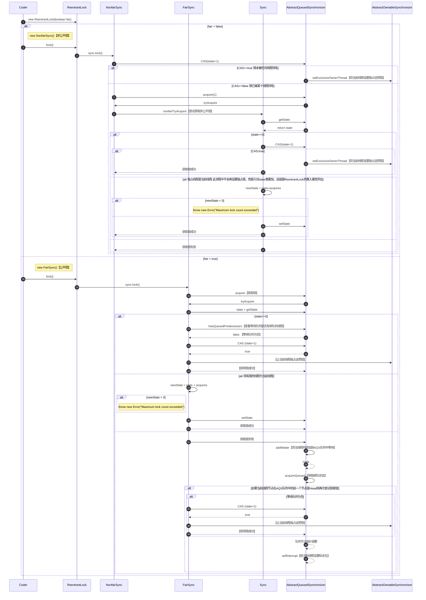
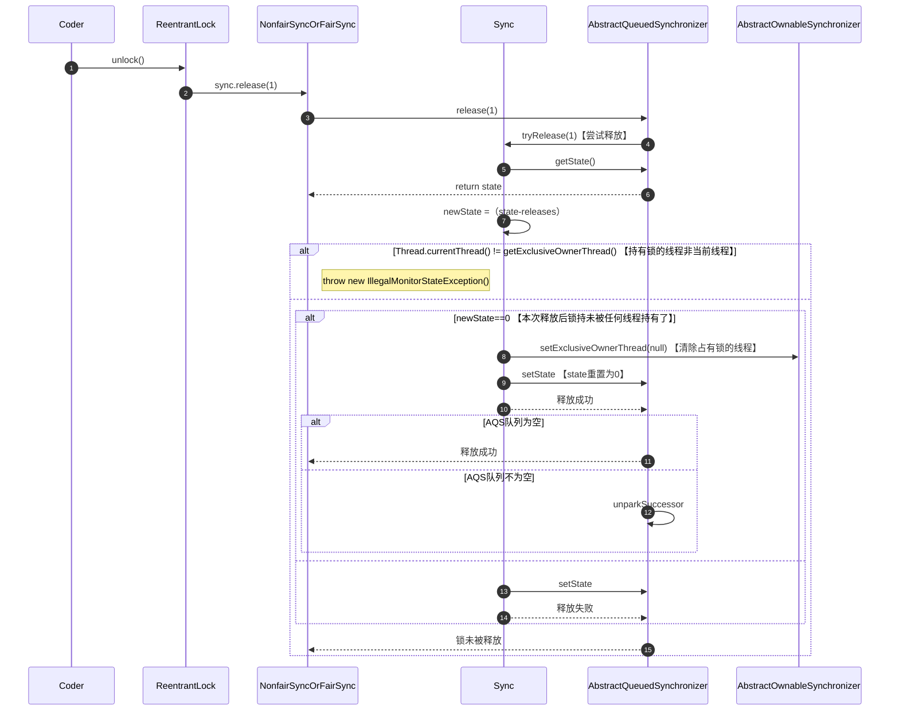

# 多线程与高并发

## 基础知识点

- 工作线程数不是设置的越大越好

- 工作线程数（线程池中线程数量）设多少合适?

  

  > **怎么得出W/C？**
  >
  > - 本地环境利用Jprofiler工具测算
  > - 远程环境用Arthas测算

## 线程创建方式

### **继承Thread**

```java
public static void main(String[] args) {
  new MyThread().start();
}

static class MyThread extends Thread {
  @Override
  public void run() {
    out.println("New Thread - extends Thread");
  }
}
```

### 实现Runnable接口

```java
public class ThreadCreate {
    public static void main(String[] args) {
        new Thread(new MyRunnable()).start();
    }

    static class MyRunnable implements Runnable {
        @Override
        public void run() {
            out.println("New Thread - implements Runnable");
        }
    }
}
```

### Lambda表达式

```java
public class ThreadCreate {
    public static void main(String[] args) {
        new Thread(() -> out.println("New Thread - Lambda"));
    }
}
```

### 线程池

```java
public class ThreadCreate {
    public static void main(String[] args) {
        //仅用于演示
        ExecutorService threadPool = Executors.newCachedThreadPool();
        threadPool.execute(() -> out.println("New Thread - threadPool"));
        threadPool.shutdown();
    }
}
```

### 实现Callable接口

```java
public class ThreadCreate {
    public static void main(String[] args) {
        //创建线程池
        ExecutorService threadPool = Executors.newCachedThreadPool();
      
        //基于线程池submit
        Future<String> future = threadPool.submit(new MyCallable());
        //阻塞等待返回值
        String data1 = future.get();
        out.println(data1);
        threadPool.shutdown();

        //基于实现RunnableFuture<V>
        FutureTask<String> task = new FutureTask<String>(new MyCallable());
        //创建线程并启动
        Thread thread = new Thread(task);
        thread.start();
        //阻塞等待返回值
        String data2 = future.get();
        out.println(data2);
    }

    static class MyCallable implements Callable {
        @Override
        public Object call() throws Exception {
            out.println("New Thread - implements Callable");
            return "success";
        }
    }
}
```

## 线程的六种状态

### NEW

> 线程刚刚创建，还没有启动

### RUNNABLE

> 可运行状态，由线程调度器可以安排执行 （包括`READY`和`RUNNING`两种细分状态）

### WAITING

> 等待被唤醒

### TIMED WAITING

> 隔一段时间后自动唤醒

### BLOCKED

> 被阻塞，正在等待锁

### TERMINATED

> 线程结束

### 代码验证

```java
public class ThreadState {
    public static void main(String[] args) throws Exception {
        //1: NEW
        //2: RUNNABLE
        //0 1 2
        //3: TERMINATED
        Thread thread1 = new Thread(() -> {
            out.println("2: " + Thread.currentThread().getState());
            for (int i = 0; i < 3; i++) {
                SleepHelper.sleepSeconds(1);
                out.print(i + " ");
            }
            //换行
            out.println();
        });

        out.println("1: " + thread1.getState());
        //thread1启动
        thread1.start();
        //等待thread1结束
        thread1.join();
        out.println("3: " + thread1.getState());

        //--------------------------------------------------------------------------------------------------
        //4: WAITING
        //thread2 Go On
        //5: TIMED_WAITING
        Thread thread2 = new Thread(() -> {
            //等待被唤醒
            LockSupport.park();
            out.println("thread2 Go On");
            SleepHelper.sleepSeconds(5);
        });

        thread2.start();
        SleepHelper.sleepSeconds(1);
        out.println("4: " + thread2.getState());

        LockSupport.unpark(thread2);
        SleepHelper.sleepSeconds(1);
        out.println("5: " + thread2.getState());

        //--------------------------------------------------------------------------------------------------
        //6: BLOCKED
        //thread3 Get Lock o
        Object o = new Object();
        Thread thread3 = new Thread(() -> {
            synchronized (o) {
                out.println("thread3 Get Lock:o");
            }
        });

        new Thread(() -> {
            synchronized (o) {
                SleepHelper.sleepSeconds(5);
            }
        }).start();
        //主线程睡一秒保证以上线程已经获得锁o
        SleepHelper.sleepSeconds(1);
        //启动thread3去竞争锁o
        thread3.start();
        SleepHelper.sleepSeconds(1);
        out.println("6: " + thread3.getState());

        //--------------------------------------------------------------------------------------------------
        //7: WAITING
        //thread4 Get Lock:o
        //JUC的锁由CAS来实现 -> '忙等待'：不会进入BLOCKED只会进入WAITING状态，只有synchronized这样的才会进入BLOCKED状态
        final Lock lock = new ReentrantLock();
        Thread thread4 = new Thread(() -> {
            lock.lock();
            out.println("thread4 Get Lock:o");
            lock.unlock();
        });

        new Thread(() -> {
            lock.lock();
            SleepHelper.sleepSeconds(5);
            lock.unlock();
        }).start();
        SleepHelper.sleepSeconds(1);

        thread4.start();
        SleepHelper.sleepSeconds(1);
        out.println("7: " + thread4.getState());

        //--------------------------------------------------------------------------------------------------
        //8: WAITING
        Thread thread5 = new Thread(LockSupport::park);
        thread5.start();
        SleepHelper.sleepSeconds(1);
        out.println("8: " + thread5.getState());
        LockSupport.unpark(thread5);
    }
}
```

### 总结


## Synchronized锁

### 锁方法

> 带`Synchronized`的方法可以与不带`Synchronized`的方法可在不同线程中同时运行

```java
public class SynchronizedTest {
    synchronized void method1() {
        out.println(Thread.currentThread().getName() + " method1 start...");
        try {
            Thread.sleep(10000);
        } catch (InterruptedException e) {
            e.printStackTrace();
        }
        out.println(Thread.currentThread().getName() + " method1 end...");
    }

    void method2() {
        out.println(Thread.currentThread().getName() + " method2 start...");
        try {
            Thread.sleep(5000);
        } catch (InterruptedException e) {
            e.printStackTrace();
        }
        out.println(Thread.currentThread().getName() + " method2 end...");
    }

    public static void main(String[] args) {
        SynchronizedTest test = new SynchronizedTest();
        new Thread(test::method1, "thread1").start();
        new Thread(test::method2, "thread2").start();
    }
}
```

### 锁的可重入属性

```java
public class SynchronizedReentrant {
    synchronized void method1() {
        out.println(Thread.currentThread().getName() + " method1 start...");
      SleepHelper.sleepSeconds(1);
        method2();
        out.println(Thread.currentThread().getName() + " method1 end...");
    }

    synchronized void method2() {
        out.println(Thread.currentThread().getName() + " method2 start...");
        SleepHelper.sleepSeconds(2);
        out.println(Thread.currentThread().getName() + " method2 end...");
    }

    public static void main(String[] args) {
        new Thread(new SynchronizedReentrant()::method1, "thread1").start();
    }
}
```

### 锁与异常

```java
public class SynchronizedAndException {
    int count = 0;

    public static void main(String[] args) {
        SynchronizedAndException test = new SynchronizedAndException();
        new Thread(test::method1, "thread1").start();
        new Thread(test::method1, "thread2").start();
    }

    synchronized void method1() {
        out.println(Thread.currentThread().getName() + " method1 start...");
        while (true) {
            count++;
            out.println(Thread.currentThread().getName() + " count = " + count);
            SleepHelper.sleepSeconds(1);
            if (count == 5) {
                //抛出ArithmeticException异常，锁被释放
                //如果catch异常则锁不被释放，循环继续
                int i = 1 / 0;
                out.println(i);
            }
        }
    }
}
```

> 运行结果

```shell
thread1 method1 start...
thread1 count = 1
thread1 count = 2
thread1 count = 3
thread1 count = 4
thread1 count = 5
thread2 method1 start...
thread2 count = 6
Exception in thread "thread1" java.lang.ArithmeticException: / by zero
	at thread_synchronized.SynchronizedAndException.method1(SynchronizedAndException.java:28)
	at java.lang.Thread.run(Thread.java:750)
thread2 count = 7
thread2 count = 8
thread2 count = 9
thread2 count = 10
```

### Synchronized底层实现

#### 锁升级

> 早期JDK`Synchronized`是重量级的，每次都要找操作系统内核申请这把锁，JDK1.5后进行了改进
>
> **如果要锁定某一个对象，则会在这个对象头的某两位来指定到底锁的是什么类型的锁，在对象头上还记录着是哪个线程申请的这把锁**
>
> - synchronized(Object) 
> - markword记录这个线程ID（偏向锁）
> - 偏向锁如果存在线程争用则升级为自旋锁
> - 自旋锁自旋10次后升级为重量级锁，去操作系统内核申请这把锁 

##### 偏向锁

> 第一次进来先不锁定这把锁，只记录一个线程ID，下一次再进来如果还是原来那个线程就可以直接访问，如果下一次进来的线程不是原来记录的线程就会进行锁升级

##### 自旋锁 

> 如果一个线程已经拿到这把锁了，当另一个线程来的时候就会while循环判断是否能获得这把锁，循环10次后如果还是不能获得锁，则再次进行锁升级

##### 重量级锁

> 经过操作系统进入等待队列，进入等待队列后则不再占用CPU资源

#### 锁的选用

> - 执行时间长，线程数较多的用系统锁（重量级锁）
>
> - 执行时间短，线程数较少的用自旋锁

### 注意事项

> - synchronized(Object) 锁的对象不能是`String常量`、`Integer`、`Long`
>
> - synchronized锁的是对象而不是代码
> - `synchronized method()`时锁的是this
> - `static synchronized method()`时锁的是Xx.class 

## Volatile

#### 保证线程可见性

#### 禁止指令重排序

##### **DCL单例** **Double Check** 

```java
public class Singleton06 {
    private static volatile Singleton06 INSTANCE;

    private Singleton06() {
    }

    public static Singleton06 getInstance() {
        if (INSTANCE == null) {
            synchronized (Singleton06.class) {
                // 双重检查
                if (INSTANCE == null) {
                    try {
                        Thread.sleep(1);
                    } catch (InterruptedException e) {
                        e.printStackTrace();
                    }
                    INSTANCE = new Singleton06();
                }
            }
        }
        return INSTANCE;
    }

    public static void main(String[] args) {
        for (int i = 0; i < 100; i++) {
            new Thread(() -> {
                System.out.println(Singleton06.getInstance().hashCode());
            }).start();
        }
    }
}
```

## 线程`interrupt` 

> 现成“打断” - 并非真正被打断而是`设置标志位`

### 三种方法

#### interrupt()

> 打断某个线程（设置标志位）

#### isInterrupted()

> 查询某个线程是否被打断过（查询标志位）

#### static interrupted()

> 查询当前线程是否被打断过，并重置打断标志

```java
public void interrupt()            //t.interrupt() 打断t线程（设置t线程某给标志位f=true，并不是打断线程的运行）
public boolean isInterrupted()     //t.isInterrupted() 查询打断标志位是否被设置（是不是曾经被打断过）
public static boolean interrupted()//Thread.interrupted() 查看“当前”线程是否被打断，如果被打断，恢复标志位
```

### 代码演示

#### interrupt和`isInterrupted`

```java
public class ThreadInterruptAndIsInterrupted {
    public static void main(String[] args) {
        Thread thread = new Thread(() -> {
            for (; ; ) {
                if (Thread.currentThread().isInterrupted()) {
                    System.out.println("Thread is interrupted...");
                    System.out.println(Thread.currentThread().isInterrupted());
                    break;
                }
            }
        });
        thread.start();
        SleepHelper.sleepSeconds(2);
        thread.interrupt();
    }
}
```

#### interrupt 和 `Interrupted`

```java
public class ThreadInterruptAndInterrupted {
    public static void main(String[] args) {

        Thread thread = new Thread(() -> {
            for (; ; ) {
                if (Thread.interrupted()) {
                    System.out.println("Thread is interrupted...");
                    System.out.println(Thread.interrupted());
                }
            }
        });
        thread.start();
        SleepHelper.sleepSeconds(2);
        thread.interrupt();

        //static interrupt ： 当前线程查询并重置标志位,由于是静态方法，可以直接调用（谁调就查谁）这边自然是查主线程
        System.out.println("main: " + thread.interrupted());
    }
}
```

#### interrupt和Sleep

```java
public class ThreadInterruptAndSleep {
    public static void main(String[] args) {
        Thread thread = new Thread(() -> {
            try {
                Thread.sleep(10000);
            } catch (InterruptedException e) {
                out.println("Thread is interrupted...");
                out.println(Thread.currentThread().isInterrupted());
            }
        });
        thread.start();
        SleepHelper.sleepSeconds(5);
        thread.interrupt();
    }
}
```

#### interrupt和Wait

```java
public class ThreadInterruptAndWait {
    public static Object o = new Object();

    public static void main(String[] args) {
        Thread thread = new Thread(() -> {
            synchronized (o) {
                try {
                    o.wait();
                } catch (InterruptedException e) {
                    out.println("Thread is interrupted...");
                    out.println(Thread.currentThread().isInterrupted());
                }
            }
        });
        thread.start();
        SleepHelper.sleepSeconds(5);
        thread.interrupt();
    }
}
```

#### interrupt不能打断Synchronized锁竞争过程

```java
public class ThreadInterruptAndSynchronized {
    public static Object o = new Object();

    public static void main(String[] args) {
        Thread thread1 = new Thread(() -> {
            synchronized (o){
                SleepHelper.sleepSeconds(10);
            }
        });
        thread1.start();
        SleepHelper.sleepSeconds(1);

        Thread thread2 = new Thread(() -> {
            synchronized (o){}
            System.out.println("thread2 end...");
        });

        thread2.start();
        SleepHelper.sleepSeconds(1);

        //不会对正在竞争锁的线程产生影响，也正说明interrupt并非真正打断线程，只是设置标志位
        thread2.interrupt();
    }
}
```

#### interrupt不能打断JUC ReentrantLock锁竞争过程

```java
public class ThreadInterruptAndReentrantLock {
    public static ReentrantLock lock = new ReentrantLock();

    public static void main(String[] args) {
        Thread thread1 = new Thread(() -> {
            lock.lock();
            try {
                Thread.sleep(10000);
            } catch (InterruptedException e) {
                e.printStackTrace();
            } finally {
                lock.unlock();
            }
            out.println("thread1 end...");
        });
        thread1.start();
        SleepHelper.sleepSeconds(1);

        Thread thread2 = new Thread(() -> {
            lock.lock();
            try {
            } finally {
                lock.unlock();
            }
            out.println("thread2 end...");
        });

        thread2.start();
        SleepHelper.sleepSeconds(1);

        //不会对正在竞争锁的线程产生影响，也正说明interrupt并非真正打断线程，只是设置标志位
        thread2.interrupt();
    }
}
```

#### 打断JUC ReentrantLock锁竞争过程

```java
public class ThreadInterruptAndReentrantLockInterruptibly {
    public static ReentrantLock lock = new ReentrantLock();

    public static void main(String[] args) {
        Thread thread1 = new Thread(() -> {
            lock.lock();
            try {
                Thread.sleep(10000);
            } catch (InterruptedException e) {
                e.printStackTrace();
            } finally {
                lock.unlock();
            }
            out.println("thread1 end...");
        });
        thread1.start();
        SleepHelper.sleepSeconds(1);

        
        Thread thread2 = new Thread(() -> {
            out.println("thread2 start...");
            try {
                //lockInterruptibly: 可以被打断的过程
                lock.lockInterruptibly();
            } catch (InterruptedException e) {
                e.printStackTrace();
            } finally {
                lock.unlock();
            }
            out.println("thread2 end...");
        });

        thread2.start();
        SleepHelper.sleepSeconds(1);

        //不会对正在竞争锁的线程产生影响，也正说明interrupt并非真正打断线程，只是设置标志位
        thread2.interrupt();
    }
}
```

> 被打断后catch住InterruptedException

```shell
thread2 start...
java.lang.InterruptedException
	at java.util.concurrent.locks.AbstractQueuedSynchronizer.doAcquireInterruptibly(AbstractQueuedSynchronizer.java:898)
	at java.util.concurrent.locks.AbstractQueuedSynchronizer.acquireInterruptibly(AbstractQueuedSynchronizer.java:1222)
	at java.util.concurrent.locks.ReentrantLock.lockInterruptibly(ReentrantLock.java:335)
	at thread_basic.ThreadInterruptAndReentrantLockInterruptibly.lambda$main$1(ThreadInterruptAndReentrantLockInterruptibly.java:36)
	at java.lang.Thread.run(Thread.java:750)
Exception in thread "Thread-1" java.lang.IllegalMonitorStateException
	at java.util.concurrent.locks.ReentrantLock$Sync.tryRelease(ReentrantLock.java:151)
	at java.util.concurrent.locks.AbstractQueuedSynchronizer.release(AbstractQueuedSynchronizer.java:1261)
	at java.util.concurrent.locks.ReentrantLock.unlock(ReentrantLock.java:457)
	at thread_basic.ThreadInterruptAndReentrantLockInterruptibly.lambda$main$1(ThreadInterruptAndReentrantLockInterruptibly.java:40)
	at java.lang.Thread.run(Thread.java:750)
```

## 线程`结束`

### 被废弃的方法

#### thread.stop

```java
public class ThreadStop {
    public static void main(String[] args) {
        Thread thread = new Thread(() -> {
            while (true) {
                out.println("Go On...");
                SleepHelper.sleepSeconds(1);
            }
        });

        thread.start();
        SleepHelper.sleepSeconds(5);

        //被废弃的方法，不建议使用
        //不管线程当前处于什么状态，直接干掉，非常容易产生数据不一致问题
        thread.stop();
    }
}
```

#### thread.suspend 和 thread.resume

```java
public class ThreadSuspendAndResume {
    public static void main(String[] args) {
        Thread thread = new Thread(() -> {
            while (true) {
                out.println("Go On...");
                SleepHelper.sleepSeconds(1);
            }
        });

        thread.start();
        SleepHelper.sleepSeconds(5);
        //5秒后暂停
        //如果暂停的时候持有一把没被释放的锁，如果忘记重新继续那这把锁永远不会被释放继而产生死锁问题
        thread.suspend();
        SleepHelper.sleepSeconds(3);
        //暂停3秒后继续
        thread.resume();
    }
}
```

### 优雅地结束一个线程

#### 利用Volatile修饰一个标志位

```java
public class ThreadEndVolatile {
    public static volatile boolean running = true;

    public static void main(String[] args) {

        Thread thread = new Thread(() -> {
            long i = 0L;
            while (running) {
                i++;
            }

            //end -- i = 3957503196
            //end -- i = 3512231997
            //不能控制具体多长时间能够停止
            System.out.println("end -- i = " + i);
        });

        thread.start();
        SleepHelper.sleepSeconds(1);

        running = false;
    }
}
```

#### 利用interrupt设置标志位（更优雅）

> Volatile中有sleep、wait的处理是没办法立刻结束的

```java
public class ThreadEndInterruptAndNormalThread {
    public static void main(String[] args) {

        Thread thread = new Thread(() -> {
            while (!Thread.interrupted()) {
                //sleep、wait的处理也可以正确结束
            }
            System.out.println("thread end");
        });

        thread.start();
        SleepHelper.sleepSeconds(1);

        thread.interrupt();
    }
}
```

## 并发编程三大特性

### 可见性（Visibility）

#### 可见性问题演示

> 此时运行程序后无论如何都不会打印`test end...`
>
> - `running`位于主内存中，但是`running`被主线程和`thread1`这两个线程所用到，线程启动会把`running`从主内存拷贝出来存到两个线程的本地缓存
> - `thread1`会去读`running`,但是每次循环读的是线程本地缓存中的内容，并不是读的主内存的`running`
> - 主线程会把本地缓存中的`running`修改为`false`,影响不到主内存中的`running`
> - 这种一个线程改了但另一个线程看不见新的值就是线程的`可见性`问题


```java
public class ThreadVolatileV1 {
    private static boolean running = true;
 
    public static void main(String[] args) {
        new Thread(ThreadVolatile::test, "thread1").start();
        SleepHelper.sleepSeconds(1);
        running = false;
    }

    private static void test() {
        System.out.println("test start...");
        while (running) {

        }
        System.out.println("test end...");
    }
}
```

> 运行结果

```shell
test start...

#迟迟等不到end
```

#### Volatile保证可见性

> - 用`Volatile`修饰的这块内存，每次循环都回去主内存重新加载一遍`running`供线程读取
> - 只要主线程本地缓存中`running`被修改立马重新刷新到主内存中


```java
public class ThreadVolatile {
    private static volatile boolean running = true;

    public static void main(String[] args) {
        new Thread(ThreadVolatile::test, "thread1").start();
        SleepHelper.sleepSeconds(1);
        running = false;
    }

    private static void test() {
        System.out.println("test start...");
        while (running) {

        }
        System.out.println("test end...");
    }
}
```

> 运行结果

```shell
test start...
test end...
```

#### println导致线程可见性

> 一些语句也可能触发内存缓存同步刷新

```java
public class ThreadVolatile {
    private static  boolean running = true;

    public static void main(String[] args) {
        new Thread(ThreadVolatile::test, "thread1").start();
        SleepHelper.sleepSeconds(1);
        running = false;
    }

    private static void test() {
        System.out.println("test start...");
        while (running) {
            //println 底层是`synchronized`，也可保证线程可见性
            System.out.println("Hello Volatile");
        }
        System.out.println("test end...");
    }
}
```

#### Volatile修饰引用类型的问题

> `只能保证引用本身`的可见性，`不能保证内部字段`的可见性

```java
public class ThreadVolatileReference {
    private volatile static TestClass t = new TestClass();

    public static void main(String[] args) {
        new Thread(t::test Method, "thread1").start();
        SleepHelper.sleepSeconds(1);
        t.running = false;
    }

    private static class TestClass {
        boolean running = true;

        void testMethod() {
            out.println("test start...");
            while (running) {
            }
            out.println("test end...");
        }
    }
}
```

#### 三级缓存(补充)

- 从CPU的ALU到`Registers`、`L1`、`L2`、`L3`、`Main Memory`

  

##### 多核CPU

> - 当`Registers`需要一个数据时，先到`L1`取，`L1`没有的话到`L2`取，以此类推直到取到`主内存`
> - 当主内存中有相关数据时，会先在`L3`存一份,然后再到`L2`存一份、再往`L1`存一份、最后丢到`寄存器`


### 有序性（Ordering）

#### 乱序

> 为了提高效率 
>
> - 要求前后两条指令不存在依赖关系


##### 乱序原则

- `as-if-serial`（看上去像序列化的）
- 不影响单线程的最终一致 性

### 原子性（Atomicity）

##  CAS

> `Compare And Swap` or`Compare And Set`
>
> **无锁自旋**
>
> JUC下所有`Atomic`类都是采用`CAS`方式保证线程安全的
>
> **没有锁的状态下，可以保持多个线程对一个值递增**


### ABA问题

- 加版本号
- 加boolean类型

### AtomicInteger

#### 使用方法

```java
public class ThreadAtomicInteger {
    AtomicInteger count = new AtomicInteger(0);

    void method() {
        for (int i = 0; i < 10000; i++) {
            count.incrementAndGet();
        }
    }

    public static void main(String[] args) {
        ThreadAtomicInteger threadAtomicInteger = new ThreadAtomicInteger();
        ArrayList<Thread> threads = new ArrayList<>();
        for (int i = 0; i < 10; i++) {
            threads.add(new Thread(threadAtomicInteger::method, "thread" + i));
        }

        threads.forEach((o) -> o.start());
        threads.forEach((o) -> {
            try {
                o.join();
            } catch (InterruptedException e) {
                e.printStackTrace();
            }
        });

        System.out.println(threadAtomicInteger.count);
    }
}
```

#### 底层原理

> 调用`Unsafe`类中`getAndAddInt`方法


> `JDK1.8`中`getAndAddInt`方法中调用了`compareAndSwapInt`方法			

​	

> `JDK11`后调用了`weakCompareAndSetInt`方法,可能引入了弱指针，对于垃圾回收效率有提升					

​	

#### Unsafe

> 可以直接实现C/C++中编码的能力，例如：
>
> 内存分配：
>
> 内存释放：

> 不同版本JDK中getUnsafe区别
>
> - Unsafe是单例的
>
> - 1.8中需要通过反射并判定类加载器是否是SystemDomainLoader才能拿到，否则没有权限使用
> - 11后可以直接返回

####  LongAdder

> `AtomicLong`VS`synchronized`VS`LongAdder`

```java
public class ThreadAtomicVsSyncVsLongAdder {
    static AtomicLong count1 = new AtomicLong(0L);
    static long count2 = 0L;
    static LongAdder count3 = new LongAdder();

    public static void main(String[] args) throws InterruptedException {
        Thread[] threads = new Thread[1000];
        for (int i = 0; i < threads.length; i++) {
            threads[i] = new Thread(() -> {
                for (int j = 0; j < 100000; j++) {
                    count1.incrementAndGet();
                }
            });
        }
        long start = System.currentTimeMillis();

        for (Thread thread : threads) {
            thread.start();
        }

        for (Thread thread : threads) {
            thread.join();
        }

        long end = System.currentTimeMillis();
        System.out.println("Atomic: " + count1.get() + " time " + (end - start));

        //-------------------------------------------------------------------------------

        Object o = new Object();
        for (int i = 0; i < threads.length; i++) {
            threads[i] = new Thread(() -> {
                for (int j = 0; j < 100000; j++) {
                    synchronized (o) {
                        count2++;
                    }
                }
            });
        }

        start = System.currentTimeMillis();

        for (Thread thread : threads) {
            thread.start();
        }

        for (Thread thread : threads) {
            thread.join();
        }

        end = System.currentTimeMillis();
        System.out.println("synchronized: " + count2 + " time " + (end - start));

        //-------------------------------------------------------------------------------

        for (int i = 0; i < threads.length; i++) {
            threads[i] = new Thread(() -> {
                for (int j = 0; j < 100000; j++) {
                    count3.increment();
                }
            });
        }

        start = System.currentTimeMillis();

        for (Thread thread : threads) {
            thread.start();
        }

        for (Thread thread : threads) {
            thread.join();
        }

        end = System.currentTimeMillis();
        System.out.println("LongAdder: " + count3 + " time " + (end - start));
    }
}
```

>  运行结果：LongAdder效率最高

```shell
Atomic: 100000000 time 1531
synchronized: 100000000 time 1522
LongAdder: 100000000 time 193
```

##### 原理

> 底层分段锁,将线程均分为几段去执行，最后计算所有段的总和

## JUC同步锁

### ReentranLock VS synchronized

> 可重入锁-用于替代`synchronized`

#### synchronized 锁的重入概念

> 当`method1`和`method2`都上了锁时，如果两个方法在同一个线程内调用是具备可重入能力的，如果在不同线程中分别调用这两个方法则会产生锁竞争
>
> `synchronized`必须可重入，否则如果当前类继承自某父类，并且父类中某方法是`synchronized`修饰的方法，那子类则无法重写父类方法。
>
> - `synchronized`当作用域内代码执行完自动解锁

```java
public class ThreadReentrantLockBySync {
    synchronized void method1() {
        for (int i = 0; i < 10; i++) {
            try {
                TimeUnit.SECONDS.sleep(1);
            } catch (InterruptedException e) {
                e.printStackTrace();
            }
            out.println(i);
            if (i == 3) {
                //由于这两个synchronized处于同一个线程内，所以是可重入的，会调用method2
                method2();
            }
        }
    }

    synchronized void method2() {
        out.println("method2...");
        try {
            TimeUnit.SECONDS.sleep(1);
        } catch (InterruptedException e) {
            e.printStackTrace();
        }
    }

    public static void main(String[] args) throws InterruptedException {
        ThreadReentrantLock reentrantLock = new ThreadReentrantLock();
        new Thread(reentrantLock::method1).start();
        TimeUnit.SECONDS.sleep(1);
        // 由于不是同一个线程导致method1在执行的时候method2不会获得这把锁，也就是不可重入，所以在method1结束前不会调用method2
        // new Thread(reentrantLock::method2).start();
    }
}
```

#### ReentranLock

```java
public class ThreadReentrantLock {
    Lock lock = new ReentrantLock();

    void method1() {
        try {
            lock.lock();
            for (int i = 0; i < 10; i++) {
                TimeUnit.SECONDS.sleep(1);
                out.println(i);
            }
        } catch (InterruptedException e) {
            e.printStackTrace();
        } finally {
            lock.unlock();
        }
    }

   void method2() {
        try {
            lock.lock();
            out.println("method2...");
        } finally {
            lock.unlock();
        }
    }

    public static void main(String[] args) throws InterruptedException {
        ThreadReentrantLock reentrantLock = new ThreadReentrantLock();
        new Thread(reentrantLock::method1).start();
        TimeUnit.SECONDS.sleep(1);
        //与synchronized相同，在不同线程中会等method1锁释放后method2才会获得这把锁
        new Thread(reentrantLock::method2).start();
    }
}
```

#####  TryLock

```java
public class ThreadReentrantLockAndTryLock {
    Lock lock = new ReentrantLock();

    void method1() {
        try {
            lock.lock();
            for (int i = 0; i < 3; i++) {
                TimeUnit.SECONDS.sleep(1);
                out.println(i);
            }
        } catch (InterruptedException e) {
            e.printStackTrace();
        } finally {
            lock.unlock();
        }
    }

    void method2() {
        boolean locked = false;
        try {
            //尝试5秒内获得锁，method1中3秒后释放锁，因此method2可以在5秒内获得获得这把锁
            locked = lock.tryLock(5, TimeUnit.SECONDS);
            out.println("method2..." + locked);
        } catch (InterruptedException e) {
            e.printStackTrace();
        } finally {
            if (locked) {
                lock.unlock();
            }
        }
    }

    public static void main(String[] args) throws InterruptedException {
        ThreadReentrantLockAndTryLock reentrantLock = new ThreadReentrantLockAndTryLock();
        new Thread(reentrantLock::method1).start();
        TimeUnit.SECONDS.sleep(1);
        //与synchronized相同，在不同线程中会等method1锁释放后method2才会获得这把锁
        new Thread(reentrantLock::method2).start();
    }
}
```

##### LockInterruptibly

```java
public class ThreadReentrantLockAndLockInterruptibly {

    public static void main(String[] args) {
        Lock lock = new ReentrantLock();
        Thread thread1 = new Thread(() -> {
            try {
                lock.lock();
                out.println("thread1 start");
                TimeUnit.SECONDS.sleep(Integer.MAX_VALUE);
                out.println("thread1 end");
            } catch (InterruptedException e) {
                out.println("thread1 Interrupted!!!");
            } finally {
                lock.unlock();
            }
        });
        thread1.start();

        Thread thread2 = new Thread(() -> {
            try {
                TimeUnit.SECONDS.sleep(1);
                lock.lockInterruptibly();
                out.println("thread2 start");
                TimeUnit.SECONDS.sleep(5);
                out.println("thread2 end");
            } catch (InterruptedException e) {
                out.println("thread2 Interrupted!!!");
            } finally {
                lock.unlock();
            }
        });
        thread2.start();

        try {
            TimeUnit.SECONDS.sleep(1);
        } catch (InterruptedException e) {
            e.printStackTrace();
        }

        thread2.interrupt();
    }
}
```

##### Fair lock（公平锁）

> 有一个等待队列，后进队列的线程先检查一下等待队列有没有未执行的线程

```java
public class ThreadReentrantLockAndFairLock extends Thread {
    //fair：true为公平锁
    public static ReentrantLock lock = new ReentrantLock(true);

    public static void main(String[] args) {
        ThreadReentrantLockAndFairLock fairLock = new ThreadReentrantLockAndFairLock();
        Thread thread1 = new Thread(fairLock);
        Thread thread2 = new Thread(fairLock);
        thread1.start();
        thread2.start();
    }

    @Override
    public void run() {
        for (int i = 0; i < 100; i++) {
            lock.lock();
            try {
                out.println(Thread.currentThread().getName() + " GET LOCK");
            } finally {
                lock.unlock();
            }
        }
    }
}
```

> 执行结果

```ABAP
Thread-1 GET LOCK
Thread-2 GET LOCK
Thread-1 GET LOCK
Thread-2 GET LOCK
Thread-1 GET LOCK
Thread-2 GET LOCK
Thread-1 GET LOCK
Thread-2 GET LOCK
Thread-1 GET LOCK
Thread-2 GET LOCK
Thread-1 GET LOCK
Thread-2 GET LOCK
Thread-1 GET LOCK
...
...
...
```

### CountDownLatch VS Join

> 倒计时门闩
>
> - CountDownLatch比join灵活一点
>
> - join必须等待一个线程结束才会 计数
> - CountDownLatch可以在一个线程内一直countDown

#### 代码演示

```java
public class ThreadCountDownLatch {
    public static void main(String[] args) {
        usingCountDownLatch();
        usingJoin();
    }


    private static void usingCountDownLatch() {
        Thread[] threads = new Thread[100];
        CountDownLatch latch = new CountDownLatch(threads.length);
        for (int i = 0; i < threads.length; i++) {
            threads[i] = new Thread(() -> {
                int result = 0;
                for (int j = 0; j < 10000; j++) {
                    result += j;
                }
                latch.countDown();
            });
        }

        for (int i = 0; i < threads.length; i++) {
            threads[i].start();
        }

        try {
            latch.await();
        } catch (InterruptedException e) {
            e.printStackTrace();
        }

        System.out.println("End Latch");
    }

    private static void usingJoin() {
        Thread[] threads = new Thread[100];
        for (int i = 0; i < threads.length; i++) {
            threads[i] = new Thread(() -> {
                int result = 0;
                for (int j = 0; j < 10000; j++) {
                    result += j;
                }
            });
        }

        for (int i = 0; i < threads.length; i++) {
            threads[i].start();
        }

        for (int i = 0; i < threads.length; i++) {
            try {
                threads[i].join();
            } catch (InterruptedException e) {
                e.printStackTrace();
            }
        }

        System.out.println("End Join");
    }
}
```

### CyclicBarrier

> 循环障碍

#### 代码演示

```java
public class ThreadCyclicBarrier {
    public static void main(String[] args) {
        CyclicBarrier barrier = new CyclicBarrier(4, () -> System.out.println("有一个满编队跳创乐园了"));

        for (int i = 0; i < 100; i++) {
            new Thread(() -> {
                try {
                    barrier.await();
                } catch (InterruptedException e) {
                    e.printStackTrace();
                } catch (BrokenBarrierException e) {
                    e.printStackTrace();
                }
            }).start();
        }
    }
}
```

### 使用场景

> 复杂操作：数据库、网络、文件
>
> 并发执行：不同线程执行不同操作，等所有操作线程都执行完了（执行完成目标个线程数后）才能执行内部逻辑

### 补充

> Guava RateLimiter  - 限流

### Phaser

#### 代码演示

> new Person
>
> 代表婚礼出席人

```java
public class Person implements Runnable {
    static Random random = new Random();

    private String name;
    private MarriagePhaser phaser;

    public Person(String name, MarriagePhaser phaser) {
        this.name = name;
        this.phaser = phaser;
    }

    @Override
    public void run() {
        arrive();
        eat();
        leave();
        hug();
    }

    //到场
    public void arrive() {
        SleepHelper.sleepSeconds(random.nextInt(10));
        System.out.println(name + "到达现场~");
        phaser.arriveAndAwaitAdvance();
    }
		//吃饭
    public void eat() {
        SleepHelper.sleepSeconds(random.nextInt(10));
        System.out.println(name + "吃完~");
        phaser.arriveAndAwaitAdvance();
    }
		//离开
    public void leave() {
        SleepHelper.sleepSeconds(random.nextInt(10));
        System.out.println(name + "离开~");
        phaser.arriveAndAwaitAdvance();
    }
		//洞房
    public void hug() {
        if ("新郎".equals(name) || "新娘".equals(name)) {
            SleepHelper.sleepSeconds(random.nextInt(10));
            System.out.println(name + "入洞房~");
            phaser.arriveAndAwaitAdvance();
        } else {
          	//本阶段出新郎新娘可参与，其他人不得入内
            phaser.arriveAndDeregister();
        }
    }
}
```

> new MarriagePhaser
>
> 代表婚礼进行阶段
>
> 进行婚礼阶段参与人数统计

```java
public class MarriagePhaser extends Phaser {
    @Override
    protected boolean onAdvance(int phase, int registeredParties) {
        switch (phase) {
            case 0:
                System.out.println("所有人到齐了~" + registeredParties);
                System.out.println();
                return false;
            case 1:
                System.out.println("所有人吃完了~" + registeredParties);
                System.out.println();
                return false;
            case 2:
                System.out.println("所有人离开了了~" + registeredParties);
                System.out.println();
                return false;
            case 3:
                System.out.println("婚礼结束~" + registeredParties);
                System.out.println();
                return true;
        }
        return false;
    }
}
```

> new ThreadPhaser

```java
public class ThreadPhaser {
    static MarriagePhaser phaser = new MarriagePhaser();

    public static void main(String[] args) {
        phaser.bulkRegister(7);
        for (int i = 0; i < 5; i++) {
            new Thread(new Person("p" + i, phaser)).start();
        }
        new Thread(new Person("新郎",phaser)).start();
        new Thread(new Person("新娘",phaser)).start();
    }
}
```

> 执行结果

```ABAP
===阶段一===
p1到达现场~
新娘到达现场~
p0到达现场~
p4到达现场~
新郎到达现场~
p2到达现场~
p3到达现场~
所有人到齐了~7

===阶段二===
p4吃完~
p3吃完~
p0吃完~
新郎吃完~
p1吃完~
p2吃完~
新娘吃完~
所有人吃完了~7

===阶段三===
p4离开~
p2离开~
新娘离开~
p3离开~
新郎离开~
p1离开~
p0离开~
所有人离开了了~7

===阶段四===
新娘入洞房~
新郎入洞房~
婚礼结束~2
```

### ReadWriteLock

#### 代码演示

```java
public class ThreadReadWriteLock {
    private static int VALUE;
  

    static Lock lock = new ReentrantLock();

    static ReadWriteLock readWriteLock = new ReentrantReadWriteLock();
    static Lock readLock = readWriteLock.readLock();
    static Lock writeLock = readWriteLock.writeLock();

    public static void main(String[] args) {
        //用ReentrantLock对于类似多线程操作会非常慢
        // Runnable readRunnable = () -> read(lock);
        // Runnable writeRunnable = () -> write(lock, new Random().nextInt());

        Runnable readRunnable = () -> read(readLock);
        Runnable writeRunnable = () -> write(writeLock, new Random().nextInt());

        for (int i = 0; i < 18; i++) {
            new Thread(readRunnable).start();
        }
        for (int i = 0; i < 2; i++) {
            new Thread(writeRunnable).start();
        }
    }

    public static void read(Lock lock) {
        try {
            lock.lock();
            Thread.sleep(1000);
            out.println("read over...");
        } catch (InterruptedException e) {
            e.printStackTrace();
        } finally {
            lock.unlock();
        }
    }

    public static void write(Lock lock, int value) {
        try {
            lock.lock();
            Thread.sleep(1000);
            VALUE = value;
            out.println("write over...");
        } catch (InterruptedException e) {
            e.printStackTrace();
        } finally {
            lock.unlock();
        }
    }
}
```

### Semaphore

> 信号灯

#### 代码演示

```java
public class ThreadSemaphore {
    public static void main(String[] args) {
      	//fair:true 公平锁 类似于排队插队
        Semaphore semaphore = new Semaphore(2,true);
        new Thread(() -> {
            try {
                //将permits改为0，其他线程acquire不到
                semaphore.acquire();
                System.out.println("T1 RUNNING...");
                Thread.sleep(200);
                System.out.println("T1 RUNNING...");
            } catch (InterruptedException e) {
                e.printStackTrace();
            } finally {
                //将permits改为1
                semaphore.release();
            }
        }).start();

        new Thread(() -> {
            try {
                semaphore.acquire();
                System.out.println("T2 RUNNING...");
                Thread.sleep(200);
                System.out.println("T2 RUNNING...");
            } catch (InterruptedException e) {
                e.printStackTrace();
            }finally {
                //将permits改为1
                semaphore.release();
            }
        }).start();
    }
}
```

### Exchanger

> 数据交换器


#### 代码演示

```java
public class ThreadExchanger {
    static Exchanger<String> exchanger = new Exchanger<>();

    public static void main(String[] args) {
        new Thread(() -> {
            String s = "T1";
            try {
                s = exchanger.exchange(s);
            } catch (InterruptedException e) {
                e.printStackTrace();
            }
            System.out.println(Thread.currentThread().getName() + " " + s);
        }, "thread1").start();

        new Thread(() -> {
            String s = "T2";
            try {
                s = exchanger.exchange(s);
            } catch (InterruptedException e) {
                e.printStackTrace();
            }
            System.out.println(Thread.currentThread().getName() + " " + s);
        }, "thread2").start();
    }
}  
```

### LockSupport

> 专门为支持锁实现的一个类
>
> - 可以唤醒指定的线程
> - `unpark`可以先于`park`调用
> - 相比与`wait/notify`更加灵活

#### 代码演示

```java
public class ThreadLockSupport {
    public static void main(String[] args) {
        Thread thread = new Thread(() -> {
            for (int i = 0; i < 10; i++) {
                out.println(i);
                if (i == 5) {
                    //当前线程阻塞停止
                    LockSupport.park();
                }
                SleepHelper.sleepSeconds(1);
            }
        });
        thread.start();
        SleepHelper.sleepSeconds(8);
        out.println("after 8 seconds");
        LockSupport.unpark(thread);
    }
}
```

## 面试题

### 题一

> 实现一个容器，提供两个方法，add，sizeques
>
> 写两个线程，线程1添加10个元素到容器中，线程2实现监控元素的个数
>
> 当个数到5个时，线程2给出提示并结束

####  Volatile实现

```java
public class ContainerWithVolatile {
    volatile List list = new ArrayList();

    //也可使用synchronizedList同步容器
    // volatile List list = Collections.synchronizedList(new ArrayList<>());

    public void add(Object o) {
        list.add(o);
    }

    public int size() {
        return list.size();
    }

    public static void main(String[] args) {
        ContainerWithVolatile container = new ContainerWithVolatile();
        new Thread(() -> {
            for (int i = 0; i < 10; i++) {
                container.add(new Object());
                out.println(i);
                SleepHelper.sleepSeconds(1);
            }
            out.println("thread1 add success...");
        }, "thread1").start();

        new Thread(() -> {
            while (true) {
                if (container.size() == 5) {
                    break;
                }
            }
            out.println("thread2 end...");
        }, "thread2").start();
    }
}
```

#### Wait/Notify实现

```java
public class ContainerWithWaitAndNotify {
    volatile List list = new ArrayList();

    public void add(Object o) {
        list.add(o);
    }

    public int size() {
        return list.size();
    }

    public static void main(String[] args) {
        ContainerWithWaitAndNotify container = new ContainerWithWaitAndNotify();

        final Object lock = new Object();

        new Thread(() -> {
            out.println("thread2 start...");
            synchronized (lock) {
                if (container.size() != 5) {
                    try {
                        lock.wait();
                    } catch (InterruptedException e) {
                        e.printStackTrace();
                    }
                }
                out.println("thread2 end...");
                //确保thread2结束后thread1能继续执行
                lock.notify();
            }
        }, "thread2").start();

        //睡一秒保证thread2先启动去监控size
        SleepHelper.sleepSeconds(1);

        new Thread(() -> {
            out.println("thread1 start...");
            synchronized (lock) {
                for (int i = 0; i < 10; i++) {
                    container.add(new Object());
                    out.println(i);
                    if (container.size() == 5) {
                        lock.notify();
                        try {
                            //由于notify不释放锁，所以notify后需要自己wait从而把锁释放出来
                            lock.wait();
                        } catch (InterruptedException e) {
                            e.printStackTrace();
                        }
                    }
                    SleepHelper.sleepSeconds(1);
                }
                out.println("thread1 end...");
            }
        }, "thread1").start();
    }
}
```

#### CountDownLatch实现

```java
public class ContainerWithCountDownLatch {
    volatile List list = new ArrayList();

    public void add(Object o) {
        list.add(o);
    }

    public int size() {
        return list.size();
    }

    public static void main(String[] args) {
        ContainerWithCountDownLatch container = new ContainerWithCountDownLatch();
        //设置两道门闩
        //size!=5：thread2关上latch1，等size==5时，thread1打开latch1
        //size==5时还需要thread1关上latch2,等待thread2执行完后再由thread2打开latch2
        //thread1继续执行，否则thread2打印可能出错
        CountDownLatch latch1 = new CountDownLatch(1);
        CountDownLatch latch2 = new CountDownLatch(1);

        new Thread(() -> {
            out.println("thread2 start...");
            if (container.size() != 5) {
                try {
                    latch1.await();
                } catch (InterruptedException e) {
                    e.printStackTrace();
                }
            }
            latch2.countDown();
            out.println("thread2 end...");
        }, "thread2").start();

        //睡一秒保证thread2先启动去监控size
        try {
            TimeUnit.SECONDS.sleep(1);
        } catch (InterruptedException e) {
            e.printStackTrace();
        }

        new Thread(() -> {
            out.println("thread1 start...");
            for (int i = 0; i < 10; i++) {
                container.add(new Object());
                out.println(i);
                if (container.size() == 5) {
                    latch1.countDown();
                    try {
                        latch2.await();
                    } catch (InterruptedException e) {
                        e.printStackTrace();
                    }
                }
            }
            out.println("thread1 end...");
        }, "thread1").start();
    }
}
```

#### LockSupport实现

```java
public class ContainerWithLockSupport {
    volatile List list = new ArrayList();
    static Thread thread1 = null;
    static Thread thread2 = null;

    public void add(Object o) {
        list.add(o);
    }

    public int size() {
        return list.size();
    }

    public static void main(String[] args) {
        ContainerWithCountDownLatch container = new ContainerWithCountDownLatch();

        thread2 = new Thread(() -> {
            out.println("thread2 start...");
            if (container.size() != 5) {
                LockSupport.park();
            }
            LockSupport.unpark(thread1);
            out.println("thread2 end...");
        });
        thread2.start();

        //睡一秒保证thread2先启动去监控size
        try {
            TimeUnit.SECONDS.sleep(1);
        } catch (InterruptedException e) {
            e.printStackTrace();
        }

        thread1 = new Thread(() -> {
            out.println("thread1 start...");
            for (int i = 0; i < 10; i++) {
                container.add(new Object());
                out.println(i);
                if (container.size() == 5) {
                    LockSupport.unpark(thread2);
                    LockSupport.park();
                }
            }
            out.println("thread1 end...");
        }, "thread1");
        thread1.start();
    }
}
```

#### Semaphore实现

> 在`thread1`线程中控制`thread2`线程启动，有效规避了由于`thread2`线程先启动`acquire`后导致`thread2`线程直接结束

```java
public class ContainerWithSemaphore {
    volatile List list = new ArrayList();
    static Thread thread1 = null;
    static Thread thread2 = null;

    public void add(Object o) {
        list.add(o);
    }

    public int size() {
        return list.size();
    }

    public static void main(String[] args) {
        ContainerWithCountDownLatch container = new ContainerWithCountDownLatch();
        Semaphore semaphore = new Semaphore(1);
        thread2 = new Thread(() -> {
            try {
                semaphore.acquire();
                out.println("thread2 end...");
                semaphore.release();
            } catch (InterruptedException e) {
                e.printStackTrace();
            }
        });

        thread1 = new Thread(() -> {
            //获取semaphore打印
            // thread1 start...
            // 0
            // 1
            // 2
            // 3
            // 4
            try {
                semaphore.acquire();
                out.println("thread1 start...");
                for (int i = 0; i < 5; i++) {
                    container.add(new Object());
                    out.println(i);
                }
                semaphore.release();
            } catch (InterruptedException e) {
                e.printStackTrace();
            }

            //thread1释放semaphore thread2启动获得semaphore并执行结束打印
            //thread2 end...
            try {
                thread2.start();
                thread2.join();
            } catch (InterruptedException e) {
                e.printStackTrace();
            }

            //thread2执行结束后释放semaphore由thread1再次获取打印
            // 5
            // 6
            // 7
            // 8
            // 9
            //执行结束释放semaphore
            try {
                semaphore.acquire();
                for (int i = 5; i < 10; i++) {
                    container.add(new Object());
                    out.println(i);
                }
                semaphore.release();
            } catch (InterruptedException e) {
                e.printStackTrace();
            }
        }, "thread1");
        thread1.start();
    }
}
```

### 题二

> 写一个固定容量同步容器，拥有`put`、`get`、`getCount`方法
>
> 能够支持2个生产者线程以及10个普通消费者线程的阻塞调用

#### Synchronized实现

```java
public class ContainerWithSynchronized<T> {
    final private LinkedList<T> list = new LinkedList<T>();
    final private int MAX = 10;
    private int count = 0;

    public synchronized void put(T t) {
        if (list.size() == MAX) {
            try {
                this.wait();
            } catch (InterruptedException e) {
                e.printStackTrace();
            }
        }
        list.add(t);
        //synchronized保证count成功加1，否则会出现没完成加1就被另一个线程读过去了，那另一个线程拿到的还是老值，可能会导致计数出错
        ++count;
        this.notifyAll();
    }

    public synchronized T get() {
        T t = null;
        //如果用`if`：当wait被唤醒则会直接往下执行，不会再次判断list.size() == 0 因此用 while
        while (list.size() == 0) {
            try {
                this.wait();
            } catch (InterruptedException e) {
                e.printStackTrace();
            }
        }
        t = list.removeFirst();
        count--;
        this.notifyAll();
        return t;
    }

    public int getCount() {
        return count;
    }

    public static void main(String[] args) {
        ContainerWithSynchronized<String> container = new ContainerWithSynchronized<>();

        for (int i = 0; i < 10; i++) {
            new Thread(() -> {
                for (int j = 0; j < 5; j++) {
                    out.println(Thread.currentThread().getName() + " 吃到了由" + container.get());
                }
            }, "consumer" + i).start();
        }

        SleepHelper.sleepSeconds(1);

        for (int i = 0; i < 2; i++) {
            new Thread(() -> {
                for (int j = 0; j < 25; j++) {
                    container.put(Thread.currentThread().getName() + "生产的 " + j + "号包子");
                }
            }, "producer" + i).start();
        }
    }
}
```

#### RenntrantLock实现

```java
public class ContainerWithRenntrantLock<T> {
    final private LinkedList<T> list = new LinkedList<>();
    final private int MAX = 10;
    private int count = 0;

    private Lock lock = new ReentrantLock();
    //Condition ： producer等待队列
    private Condition producer = lock.newCondition();
    //Condition ： consumer等待队列
    private Condition consumer = lock.newCondition();

    public void put(T t) {
        try {
            lock.lock();
            while (list.size() == MAX) {
                producer.await();
            }
            list.add(t);
            //synchronized保证count成功加1，否则会出现没完成加1就被另一个线程读过去了，那另一个线程拿到的还是老值，可能会导致计数出错
            ++count;
            consumer.signalAll();
        } catch (InterruptedException e) {
            e.printStackTrace();
        } finally {
            lock.unlock();
        }
    }

    public T get() {
        T t = null;
        try {
            lock.lock();
            while (list.size() == 0) {
                consumer.await();
            }
            t = list.removeFirst();
            count--;
            producer.signalAll();
        } catch (InterruptedException e) {
            e.printStackTrace();
        } finally {
            lock.unlock();
        }
        return t;
    }

    public int getCount() {
        return count;
    }

    public static void main(String[] args) {
        ContainerWithRenntrantLock<String> container = new ContainerWithRenntrantLock<>();

        for (int i = 0; i < 10; i++) {
            new Thread(() -> {
                for (int j = 0; j < 5; j++) {
                    out.println(Thread.currentThread().getName() + " 吃到了由" + container.get());
                }
            }, "consumer" + i).start();
        }

        SleepHelper.sleepSeconds(2);

        for (int i = 0; i < 2; i++) {
            new Thread(() -> {
                for (int j = 0; j < 25; j++) {
                    container.put(Thread.currentThread().getName() + "生产的 " + j + "号包子");
                }
            }, "provider" + i).start();
        }
    }
}
```

## AQS (CLH)  

> - AQS内部维护了一个共享的由`volatile`修饰的`int`类型的`state`和一个`双向链表`
> - `state`主要取决于`AQS`子类的实现方式
>   - `ReentrantLock` 就是拿这个`state`作为`线程重入次数的计数`
>
> - 每个节点装的是Thread (线程节点) 
> - 每个线程节点去争用`state`，哪个线程获取到哪个线程就持有这把锁


### ReentrantLock源码

#### 类继承关系


#### lock



#### unlock



